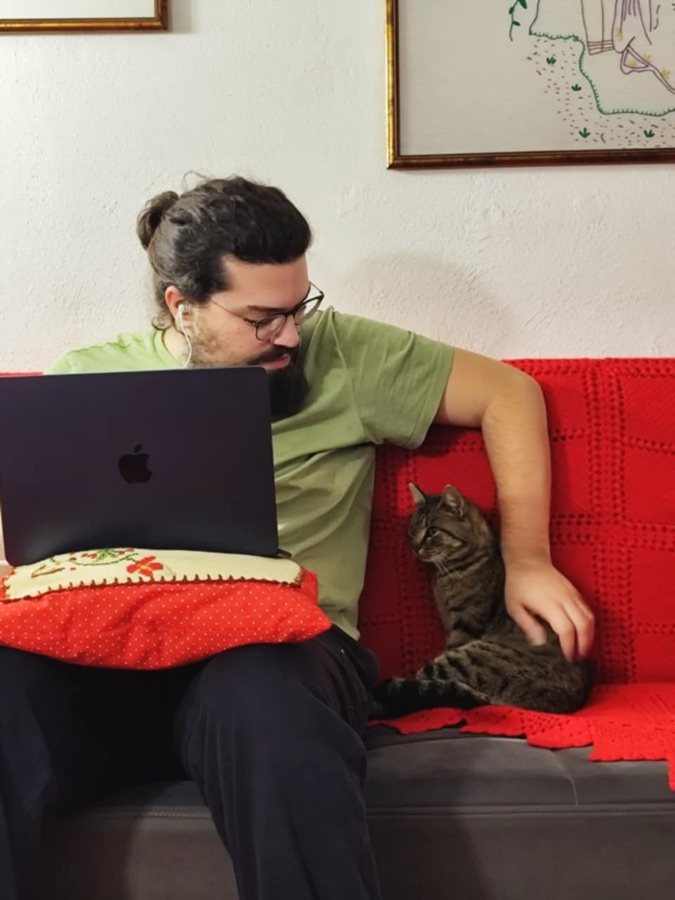

Hey there, I'm Dimosthenis Avgeris. Dimos, for short.

Currently, I'm the Head of Product at instacar, where every day brings new learnings, challenges, and a chance to grow.

Funny thing, my career began in a place many might not expect: esports. Together with some passionate teammates, we built and managed news and media companies that celebrated the dynamic world of esports. It was fast-paced, thrilling, and it taught me loads about how digital worlds and real-life communities intersect. Yes, I used to play StarCraft II for a living, when I was 19!

Following this, in collaboration with Dimitris — an esteemed colleague and friend — I co-founded a subscription service, curating boxes teeming with memorabilia from iconic movies and series. The subscription model taught me this: while it offers the allure of steady, recurring revenue, it comes with its own set of challenges, from churn rates to the constant need for innovation to keep subscribers engaged. Adaptability is essential.

My next chapter took me to Pizza Fan, the largest pizza company in Greece. My journey there was defined by teamwork and data-driven solutions. I led a passionate marketing team and worked hand-in-hand with designers and developers, restructuring our app and website for a better UX, along with critical backend changes. My partnership with the CEO led us to craft strategies for growth and customer retention. A significant milestone was integrating digital and CRM tracking, ensuring our decisions were always data-informed. The lesson from this chapter? Collaboration amplifies success; when diverse teams unite with a shared vision, magic happens.

Stepping into instacar's world as the first Marketing hire, I was handed a clear task: build a cohesive marketing team from ground zero and give a unique identity to instacar in the vast car leasing landscape. I was fortunate to collaborate with some of the most dedicated individuals, many of whom still contribute their expertise at instacar today. As Henry Ford once said:

> Coming together is a beginning, staying together is progress, and working together is success.

The leap from marketing to product management came from the belief instilled in me by Antonis Samothrakis, our CEO, and my now dear friends **Konstantinos Giamalis**, CPO of efood (if you're into product management you should definitely check his [blog](https://kgiamalis.co/)), and **Dimitris Togias** (CTO, instacar). They saw a potential in me that I hadn't seen in myself.

In my current role, I'm data-oriented and people-focused. I believe in building products that resonate with real people and managing teams with a consumer-first mindset. For me, "pragmatic product management" is the essence of startups and scale-ups like instacar. We build fast and ship fast, focusing on what's necessary and feasible.

This blog is, first and foremost, **a document of my journey**. It's a reflection of my learning curve, a place to learn from my experiences, and hopefully a guide for others embarking on a similar path in product management.

Outside of the office, I'm a passionate musician, playing the bouzouki — a Greek instrument — since I was 13, with a special love for rebetiko music from the early 20th century. I also enjoy building mechanical keyboards from scratch, experimenting with coffee roasts, and I have a deep interest in astronomy.

I dropped out of the Economics Department at the University of Piraeus, but my real education has come from the blend of marketing, data, entrepreneurship, and product management that has shaped my career.

Join me on this journey. Learn from my experiences, and let's navigate the exciting world of product management!

Keep iterating and stay curious!

[LinkedIn](https://www.linkedin.com/in/dimosthenis-avgeris/)
