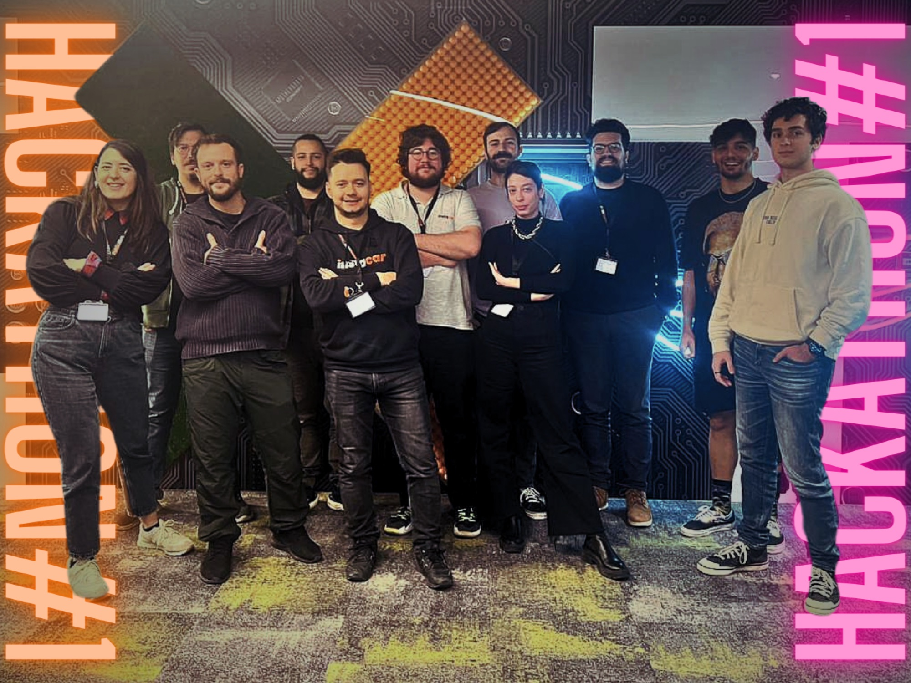
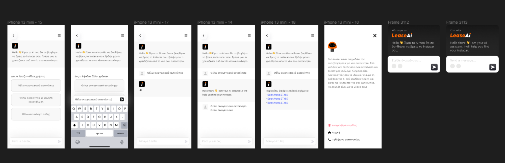

Today marks a milestone in both instacar's journey and my own — our first hackathon, an event that brought together diverse minds and talents from product, marketing, and tech to shape a new vision for our users' experience. It's a day that underscores our commitment to innovation, reflected in the development of **LeaseAi**, our AI-driven chatbot.

Developing an AI-driven chatbot might seem like a routine task in the tech world, but for us it was an exploration into how technology can be harnessed in a meaningful way, resonating with real user needs. Today's hackathon wasn't just about fulfilling company objectives; it was about stepping out of our individual roles and coming together as innovators, thinkers, creators.

## The Design Philosophy: Less is More

From the outset, our design philosophy was clear: **less is more.** The Figma drafts, which evolved rapidly through the day, were a testament to this. We avoided unnecessary elements, choosing instead to focus on essential features that would enhance user interaction without overwhelming them.

Inputs from different team members added richness to the design, while keeping aligned with our minimalist theme.

## Personal Reflections on Today's Hackathon

The main purpose of the hackathon wasn't merely the completion of LeaseAi, but the realization of a vision where teamwork and innovation intersect. This wasn't about a corporate achievement; it was a **personal and collective victory**, a step towards fostering a more innovative and collaborative environment — a journey I am proud to lead and be a part of.
