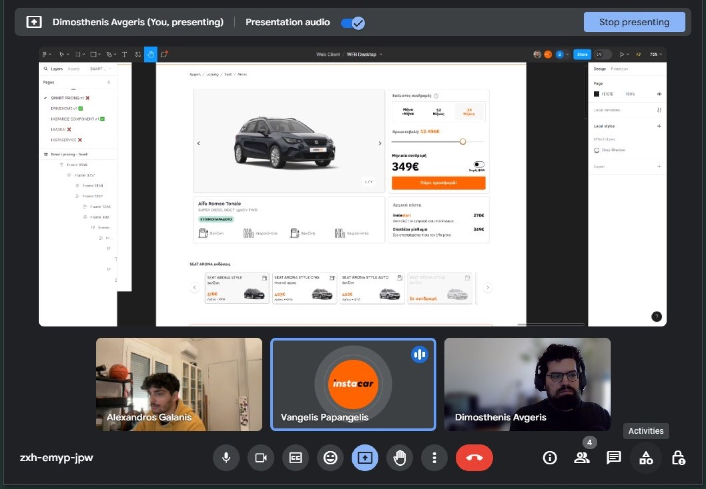
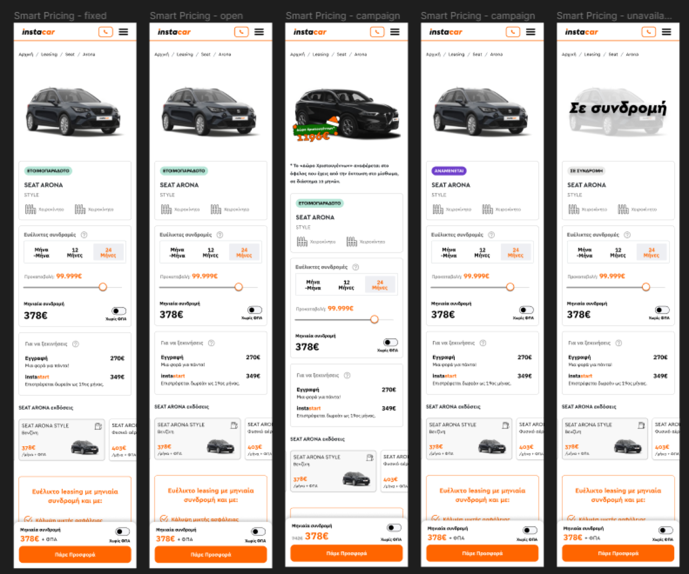

## The Catalyst for Innovation

At [instacar](https://www.instacar.gr/), we're always listening to our customers. When we started hearing that many of them were looking for more than our flexible month-to-month leasing option, we paid attention. They wanted longer-term plans to fit their lives better — plans that gave them the security of a fixed commitment.

Our research confirmed it: there was clear demand for 12- and 24-month leasing options. People were looking for predictability, whether for personal reasons or business stability. Offering these fixed-term subscriptions wasn't just about adding another choice; it was about meeting a real need and growing our business in a way that made sense for our customers and us.

## From Concept to Reality

When we decided to introduce 12- and 24-month plans, we knew the key was in the simplicity of the experience. Every customer should find navigating these plans as intuitive as having a conversation.

Alongside Vangelis (Lead Product Designer), we started experimenting with different looks and page structures. Over the years I've gained some insight into customer behavior, particularly through the data provided by Microsoft Clarity. Every click is significant, and the first step to encourage the right actions is to closely monitor how users interact with our platform. Moving to Figma, we created designs that laid out the new plans clearly and concisely.

After our initial designs, we engaged in a feedback loop with potential users and internal teams. This step was crucial for refining our approach, making sure our designs were not only attractive but also practical and easy to navigate.

With our refined designs, our front-end team began turning them into reality — meticulous coding to ensure the designs faithfully translated into a functional, responsive web experience, with extensive testing and iteration based on feedback and technical requirements.

Simultaneously, our backend team, led by Alex Galanis, worked on the logic supporting these plans — from pricing calculations to contract durations — making sure the system could handle the new subscription types efficiently and fit within our existing ecosystem.

## Team Collaboration

Bringing our new 12- and 24-month subscriptions to life was a big team effort. I had the privilege of guiding our Product team through it, but it truly was a collective effort from start to finish.

Our first step was to understand the numbers, which meant sitting down with Finance. They helped us figure out how to offer these plans in a way that's good for both our customers and our business. Then we got invaluable insights from Operations — the people who talk to our customers every day — on what people were looking for and how we could deliver it smoothly.

> 💬 229 Slack messages were sent in the #smart-pricing channel

With those insights in hand, the design team took the lead. They have a special talent for making complex things simple and engaging. Then Engineering took over, turning those designs into reality on our website and tackling the technical challenges so everything runs smoothly and intuitively.

> 📜 26 Linear tickets were created for Smart Pricing

This journey wasn't straight from A to B. We went through many rounds of testing and feedback, always aiming to make things better. Every piece of feedback was a chance to improve. When we finally launched, it was a moment of pride for all of us — the engineers in particular went above and beyond to solve last-minute hurdles.

## Learning from Our Journey and Looking Ahead

Launching the new plans went really smoothly, and we couldn't be happier. This wasn't just good news for our customers — it made all of us on the team feel proud of what we accomplished together.

**Why it matters:** when things go smoothly, it's a big morale boost. It shows that when we pull together, we can do great things. It's not just about the work itself but about how we grow stronger as a team.

Darren Hardy, author of *The Compound Effect*, describes the principle as "reaping huge rewards from a series of small, smart choices." What we experienced with our smooth launch and the incremental improvements that followed is a perfect example of this at work in a business setting.

The compound effect isn't about making one massive change; it's about the power of small, consistent changes over time. Every adjustment based on customer feedback, every tweak to the UI, every code improvement contributed to a larger impact. As Hardy puts it: **"Small, seemingly insignificant steps completed consistently over time will create a radical difference."**

The smooth launch wasn't a one-time effort; it was the result of continuous work, learning, and iteration. It's these small, daily efforts that add up, creating a stronger, more resilient, more innovative company.

## Wrapping Up

The path ahead is one of ongoing development, guided by our experiences and the insights we gain along the way.

Until the next one, keep iterating and stay curious!
