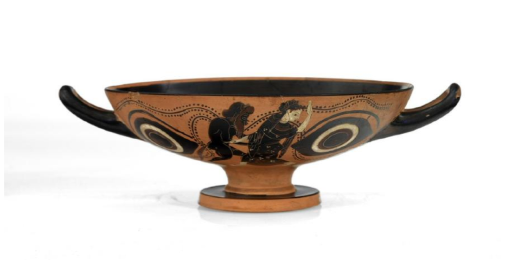
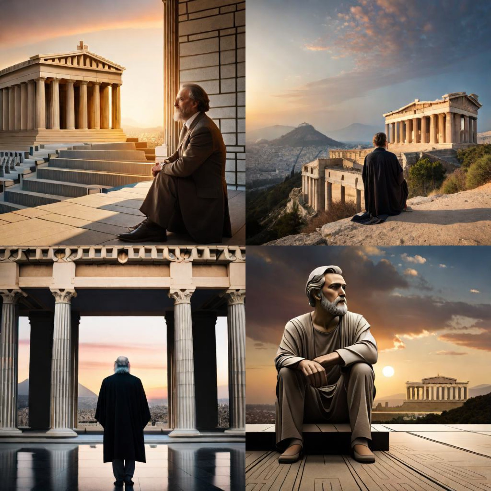

The world of User Experience (UX) might seem like a product of the digital age, but its roots run deep into history, notably with the ancient Greeks. While they didn't have digital interfaces or software applications, their profound understanding of human nature, aesthetics, and functionality laid the groundwork for what we now recognize as UX principles.

I began exploring this historical link when I enrolled in a course at [Uxcel](https://uxcel.com/) — if you're passionate about Product Design, you should definitely check it out.

So how exactly did the ancient Greeks use "UX" techniques?

## Architecture and City Planning

The ancient Greeks were master builders. Structures like the Parthenon were not just aesthetically pleasing but also designed for human interaction. The Parthenon, apart from being a temple, was a treasury and held significant cultural artifacts. Its proportional design and orientation took the viewer's perspective into account, ensuring a harmonious experience.

The temple is perfectly aligned with the rising sun on the summer solstice, creating a truly awe-inspiring sight. It's also carefully proportioned, with each element considered to create a harmonious whole.

## Ergonomics in Tool Design

The ancient Greeks understood ergonomics, designing tools and items that fit the human body and its cognitive abilities. The design of their pottery, for instance, was ergonomic — [amphoras](https://en.wikipedia.org/wiki/Amphora) (large vases) had two handles for balanced carrying.

**Example:** the Greek "kylix," a type of wine-drinking cup, was designed with a wide, shallow body and a stemmed base, allowing the drinker to hold it without warming the wine with the heat of their hand.

*Don Norman would be proud.*

## Education and Knowledge Transfer

The ancient Greeks valued education, with methods like the [Socratic method](https://zapier.com/blog/socratic-questioning-in-business/) emphasizing user engagement, ensuring the learner was an active participant.

The Socratic method — a form of cooperative argumentative dialogue — was used to stimulate critical thinking and draw out ideas. This interactive form of learning is similar to modern user interviews, surveys, and usability tests.

---

For those who made it this far, here's an AI image made with [BlueWillow](https://www.bluewillow.ai/). The prompt was generated with the help of Photorealistic, a ChatGPT plugin.

*Prompt: Ancient Greeks interacting with large stone tablets displaying modern UX designs, with the Acropolis prominently in the background. Medium: Digital Art. Style: Cartoonish-realistic reminiscent of Monet's impressionism. Lighting: Golden hour with soft, warm hues casting long shadows. Colors: Earthy tones with pops of vibrant blues and golds. Composition: Nikon D850 DSLR camera, 35mm lens, sharp focus on the Greeks and their tablets, with a slightly blurred Acropolis in the distance. Depth-of-field to emphasize the subjects in the foreground. --ar 16:9 --v 5.1 --style raw --q 2 --s 750*

