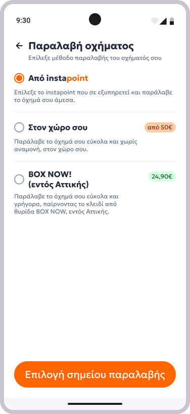
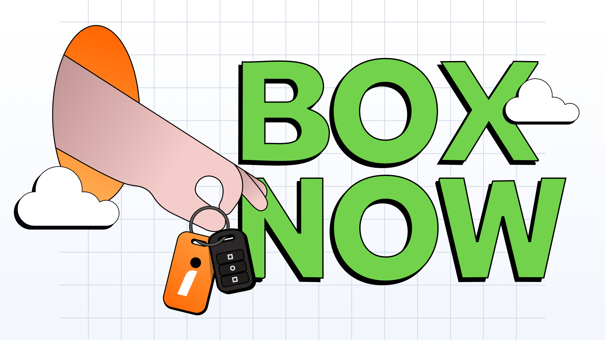

We shipped something a bit unusual this year at instacar: car key delivery through a [BoxNow locker](https://www.linkedin.com/posts/instakar_instacar-boxnow-activity-7440032055549267968-wqGp).

The concept sounds simple: instead of coordinating with a courier and being available at a specific time, a subscriber can select a nearby BoxNow locker, pick up their car key at their own convenience, 24/7, no queues, no appointments. But the execution underneath that simple UX involved a lot of moving parts.

## What we actually built

The integration touched pretty much every layer of the product. On the customer side, we added a new delivery type selection flow in the app: subscribers in Athens can choose BoxNow as their delivery method, pick a locker from a map, and from that point receive step-by-step instructions both in-app and by email.

On the operations side, we built tooling in Instafleet (our internal fleet management tool) that lets our Customer Success agents manually assign a BoxNow delivery point to a subscription. A webhook from BoxNow's system then triggers emails at the right stages: when the key is on its way, when it's been delivered to the locker, and when the delivery is confirmed completed.

We also built an email scraper inside our unified view to automatically extract the PIN codes BoxNow sends for key retrieval, removing a manual step that would have killed the experience.

## Why it matters

Delivery logistics are one of the biggest friction points in a car subscription service. You're not delivering a small package — you're delivering the moment someone gets to drive their new car. Every failed coordination, every "I missed the courier" call to CS, erodes trust.

BoxNow's locker network in Greece has grown to over 2,200+ locations. Plugging into that infrastructure means we can offer flexibility that a traditional courier model simply can't match.

## What I learned from it

This was a good reminder that integrations are never just API work. Most of the complexity lived in the edge cases: what happens if a delivery is cancelled mid-flow? What does the CS agent see? What emails fire and when? The backend-to-frontend coordination across the app, instafleet, and external webhooks required a lot of disciplined spec work before a single line of code was written.

The feature shipped. Subscribers in Attica can now get their car key on their own schedule. That's the part that matters.

Keep iterating and stay curious!
