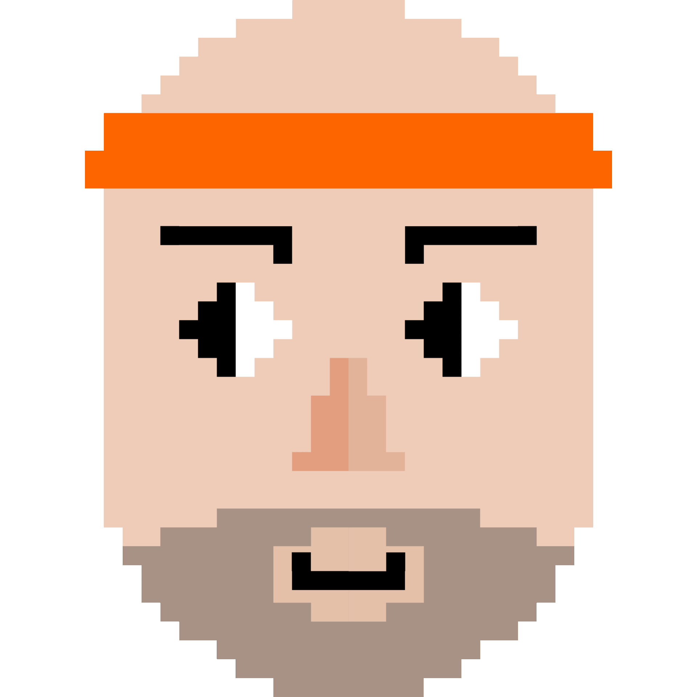

# So, I Made a Game: [carboldie.gr](https://carboldie.gr/)



## The Idea

So, I made a game. It's nothing fancy, just a simple browser game featuring CarBoldie, our company mascot at [instacar](https://www.instacar.gr/). I'm not a game developer — or any developer at all — by any stretch, but I thought it'd be fun to try. Plus, who doesn't like 8-bit games, right?

## Getting Started with AI

I decided to use Claude AI to help me out. Here's how our conversation started:

> I would like you to create a simple, HTML5-based arcade game inspired by classic arcade games like a catch game. The game should feature my company's mascot, CarBoldie. The key requirements are:
>
> - **CarBoldie Mascot:** CarBoldie should be the main playable character.
> - **Difficulty Progression:** as the player progresses, difficulty should increase — bad blocks move faster, new spinning obstacles appear, and bad blocks increase in number.
> - **Responsive Design:** optimized for both desktop and mobile.
> - **HTML5 Implementation:** HTML5, CSS, and JavaScript, easy to deploy on my website.
> - **Simplicity and Accessibility:** simple, intuitive gameplay with one-button controls.
> - **Replayability:** high scores and leaderboards to encourage players to keep coming back.
>
> Provide a step-by-step guide on how to implement it. Use simple and clear guidelines because I am a complete beginner to coding. I use a MacBook and VS Code.

**Response:** *Let's start with setting up the basic HTML structure and canvas. Here's a simple HTML file to get you started:*

```html
<!DOCTYPE html>
<html lang="en">
<head>
    <meta charset="UTF-8">
    <meta name="viewport" content="width=device-width, initial-scale=1.0">
    <title>CarBoldie Game</title>
    <style>
        canvas {
            border: 1px solid black;
        }
    </style>
</head>
<body>
    <canvas id="gameCanvas" width="400" height="600"></canvas>
    <script src="game.js"></script>
</body>
</html>
```

This was a great starting point, but I realized I wanted to add more elements to make the game feel more complete. So, I asked Claude to help me expand on this.

## Building the Game

### Setting Up

I asked Claude to help me create a more comprehensive HTML structure with start and game over screens. Here's what we came up with:

```html
<!DOCTYPE html>
<html lang="en">
<head>
    <meta charset="UTF-8">
    <meta name="viewport" content="width=device-width, initial-scale=1.0">
    <title>CarBoldie Game</title>
    <link rel="stylesheet" href="style.css">
</head>
<body>
    <div id="gameContainer">
        <div id="startScreen">
            <h1>CARBOLDIE GAME</h1>
            <div id="gifContainer">
                
            </div>
            <button id="startButton">START GAME</button>
        </div>
        <div id="gameOverScreen" style="display: none;">
            <h1>Game <span class="over-text">Over</span></h1>
            
            <p>Your Score: <span id="finalScore"></span></p>
            <button id="tryAgainButton">Play Again</button>
        </div>
        <canvas id="gameCanvas"></canvas>
    </div>
    <script src="game.js"></script>
</body>
</html>
```

The `gameContainer` div holds all the game elements. There's a `startScreen` with a title, a GIF of CarBoldie, and a start button, plus a hidden `gameOverScreen` that shows the score and a "Play Again" button. The canvas is where the game is rendered.

### Game Logic

The game logic was the trickiest part. Here's an example of one of our exchanges:

**Me:** "How do I handle object creation and collision detection?"

**Claude:**

```javascript
const objects = [];

function createObject() {
    const object = {
        x: Math.random() * (canvas.width - 30),
        y: 0,
        width: 30,
        height: 30,
        speed: Math.random() * 2 + 1,
        type: Math.random() < 0.7 ? 'good' : 'bad'
    };
    objects.push(object);
}

function checkCollision(player, object) {
    return (
        player.x < object.x + object.width &&
        player.x + player.width > object.x &&
        player.y < object.y + object.height &&
        player.y + player.height > object.y
    );
}

function updateObjects() {
    for (let i = objects.length - 1; i >= 0; i--) {
        const obj = objects[i];
        obj.y += obj.speed;

        if (checkCollision(player, obj)) {
            if (obj.type === 'good') {
                score++;
            } else {
                gameOver();
            }
            objects.splice(i, 1);
        } else if (obj.y > canvas.height) {
            objects.splice(i, 1);
        }
    }
}
```

This was super helpful, but I needed to modify it for my specific game — different types of objects, not just 'good' and 'bad'. I later added 'special blocks' like the magnet and the shield.

### Visual Stuff

For the visuals, I wanted images instead of simple shapes. Claude suggested using the `Image` object in JavaScript:

```javascript
const playerImage = new Image();
playerImage.src = 'images/carboldie.png';

const goodObjectImage = new Image();
goodObjectImage.src = 'images/good_object.png';

const badObjectImage = new Image();
badObjectImage.src = 'images/bad_object.png';

function drawPlayer() {
    ctx.drawImage(playerImage, player.x, player.y, player.width, player.height);
}

function drawObjects() {
    objects.forEach(obj => {
        const img = obj.type === 'good' ? goodObjectImage : badObjectImage;
        ctx.drawImage(img, obj.x, obj.y, obj.width, obj.height);
    });
}
```

## Diving into the Code

### Canvas Setup

```javascript
const canvas = document.getElementById('gameCanvas');
const ctx = canvas.getContext('2d');

const GAME_WIDTH = 400;
const GAME_HEIGHT = 700;
let scale;

function resizeCanvas() {
    const containerWidth = gameContainer.clientWidth;
    const containerHeight = gameContainer.clientHeight;

    if (window.innerWidth <= 767) { // Mobile view
        canvas.width = containerWidth;
        canvas.height = containerHeight;
        canvas.style.width = `${containerWidth}px`;
        canvas.style.height = `${containerHeight}px`;
        scale = Math.max(containerWidth / GAME_WIDTH, containerHeight / GAME_HEIGHT);
    } else { // Desktop view
        scale = Math.min(containerWidth / GAME_WIDTH, containerHeight / GAME_HEIGHT);
        canvas.width = GAME_WIDTH;
        canvas.height = GAME_HEIGHT;
        canvas.style.width = `${GAME_WIDTH * scale}px`;
        canvas.style.height = `${GAME_HEIGHT * scale}px`;
    }

    player.x = (player.x / GAME_WIDTH) * canvas.width;
    player.y = canvas.height - 80;
}
```

For mobile (width ≤ 767px), it fills the entire screen. For desktop, it maintains the game's aspect ratio while fitting within the available space.

### Game Loop

```javascript
function update() {
    if (gameState !== 'playing') return;

    ctx.clearRect(0, 0, canvas.width, canvas.height);

    updateBackground();
    updatePlayer();
    updateObjects();
    createObjects();
    checkCollisions();
    updateScore();

    requestAnimationFrame(update);
}
```

`requestAnimationFrame` is used instead of `setInterval` for better performance and smoother animations.

### Player Movement

```javascript
function updatePlayer() {
    if (keys['ArrowLeft'] && player.x > 0) {
        player.x -= player.speed;
        createParticle(player.x + player.width, player.y + player.height / 2, 'right');
    }
    if (keys['ArrowRight'] && player.x < canvas.width - player.width) {
        player.x += player.speed;
        createParticle(player.x, player.y + player.height / 2, 'left');
    }

    player.x = Math.max(0, Math.min(canvas.width - player.width, player.x));
}
```

## Adding Complexity

### Power-ups

Adding power-ups was an afterthought, but it really made the game more fun. The shield power-up:

```javascript
const player = {
    // ... other properties ...
    isShielded: false,
    shieldTimer: 0
};

function updatePlayer() {
    // ... other update logic ...
    if (player.isShielded) {
        player.shieldTimer--;
        if (player.shieldTimer <= 0) {
            player.isShielded = false;
        }
    }
}

function checkCollision(player, object) {
    if (checkCollisionGeometry(player, object)) {
        if (object.type === 'shield') {
            player.isShielded = true;
            player.shieldTimer = 300; // 5 seconds at 60 fps
            return false; // Don't count as collision, just pick up the shield
        }
        if (object.type === 'bad' && player.isShielded) {
            return false; // Shield protects from bad objects
        }
        return true;
    }
    return false;
}
```


Then a magnet power-up that attracts good objects:

```javascript
const player = {
    // ... other properties ...
    hasMagnet: false,
    magnetTimer: 0,
    magnetRange: 150
};

function updatePlayer() {
    // ... other update logic ...
    if (player.hasMagnet) {
        player.magnetTimer--;
        if (player.magnetTimer <= 0) {
            player.hasMagnet = false;
        } else {
            attractObjects();
        }
    }
}

function attractObjects() {
    objects.forEach(obj => {
        if (obj.type === 'good' && !obj.avoid) {
            const dx = player.x - obj.x;
            const dy = player.y - obj.y;
            const distance = Math.sqrt(dx * dx + dy * dy);
            if (distance < player.magnetRange) {
                const angle = Math.atan2(dy, dx);
                obj.x += Math.cos(angle) * 5;
                obj.y += Math.sin(angle) * 5;
            }
        }
    });
}
```


### Difficulty Scaling

```javascript
let gameSpeed = 2;
let lastSpeedIncrease = 0;
let difficultyMultiplier = 1;

function updateGameDifficulty() {
    if (Date.now() - lastSpeedIncrease > 15000) {
        gameSpeed += 0.2;
        difficultyMultiplier += 0.15;
        lastSpeedIncrease = Date.now();
    }
}

function createObject() {
    // ... existing object creation logic ...
    object.speed *= gameSpeed;
    if (Math.random() < 0.1 * difficultyMultiplier) {
        object.isFast = true;
        object.speed *= 1.5;
    }
}
```

Every 15 seconds, `gameSpeed` and `difficultyMultiplier` increase, making objects fall faster and increasing the chance of 'fast' objects.

### Particle Effects

```javascript
const particles = [];

function createParticle(x, y, color) {
    return {
        x: x,
        y: y,
        size: Math.random() * 3 + 2,
        speedX: Math.random() * 4 - 2,
        speedY: Math.random() * 4 - 2,
        color: color,
        life: 30
    };
}

function createExplosion(x, y, color, particleCount) {
    for (let i = 0; i < particleCount; i++) {
        particles.push(createParticle(x, y, color));
    }
}

function updateParticles() {
    for (let i = particles.length - 1; i >= 0; i--) {
        const p = particles[i];
        p.x += p.speedX;
        p.y += p.speedY;
        p.life--;
        if (p.life <= 0) {
            particles.splice(i, 1);
        } else {
            ctx.fillStyle = p.color;
            ctx.globalAlpha = p.life / 30;
            ctx.beginPath();
            ctx.arc(p.x, p.y, p.size, 0, Math.PI * 2);
            ctx.fill();
            ctx.globalAlpha = 1;
        }
    }
}
```

## Oops! Mistakes I Made

**1. Forgetting to Clear the Canvas.** At first, my objects left trails across the screen. Claude pointed out that I needed to clear the canvas before each draw:

```javascript
function update() {
    ctx.clearRect(0, 0, canvas.width, canvas.height);
    // ... rest of update function
}
```

**2. Memory Leak with Particles.** I added a particle system for explosions but forgot to remove old particles. The game started lagging after a while:

```javascript
function updateParticles() {
    for (let i = particles.length - 1; i >= 0; i--) {
        const p = particles[i];
        p.life--;
        if (p.life <= 0) {
            particles.splice(i, 1);
        } else {
            // Update and draw particle
        }
    }
}
```

**3. Not Handling Screen Resizes.** The game looked weird on different screen sizes. Adding an event listener for resize events:

```javascript
window.addEventListener('resize', function() {
    resizeCanvas();
});

function resizeCanvas() {
    // ... resize logic ...
    player.x = (player.x / GAME_WIDTH) * canvas.width;
    player.y = canvas.height - 80;
}
```

Oh man, this screwed me multiple times.

## Cool Code Bits

**Weighted Random Object Creation:**

```javascript
function createObject() {
    const totalWeight = objectTypes.reduce((sum, type) => sum + type.weight, 0);
    let randomWeight = Math.random() * totalWeight;
    let selectedType;

    const badObjectBias = Math.min((gameSpeed - 2) * 0.1, 0.5);
    const powerUpBoost = 0.05;

    for (const type of objectTypes) {
        let adjustedWeight = type.weight;
        if (type.avoid) {
            adjustedWeight *= (1 + badObjectBias);
        } else if (type.powerUp) {
            adjustedWeight *= (1 + powerUpBoost);
        }

        if (randomWeight < adjustedWeight) {
            selectedType = type;
            break;
        }
        randomWeight -= adjustedWeight;
    }

    // ... create object based on selectedType
}
```

This uses weighted random selection to choose which object type to create, adjusting weights based on game speed so bad objects get more common as the game progresses.

## What I Learned

1. **AI is Pretty Cool.** Claude was super helpful. It's like having a patient teacher who's always ready to explain things.
2. **Start Simple, Then Add Complexity.** I started with a basic game and gradually added features. This made the process less overwhelming.
3. **Test Early, Test Often.** I caught a lot of bugs by playing the game frequently during development. The Live Server addon in VS Code helped a lot.
4. **Don't Be Afraid to Ask.** When I was stuck, I asked Claude for help. Sometimes it took a few tries, but persistence paid off.
5. **Performance Matters.** Especially with things like particle systems and collision detection.
6. **Responsive Design is Tricky.** Making the game work well on both desktop and mobile was challenging but important.

## Future Ideas

1. **Leaderboard:** a server-side leaderboard to track high scores.
2. **Power-up Combos:** allow power-ups to combine for interesting effects.
3. **Boss Battles:** occasional boss encounters for extra challenge.
4. **Customizable Characters:** let players choose different characters or customize CarBoldie.
5. **Sound Effects and Music:** add audio to enhance the experience.

## Wrapping Up

So, that's how I made a game with the help of AI. It's not perfect, but it works, and I learned a ton in the process. If you're thinking about trying something similar, go for it. Start simple, build up gradually, and don't be afraid to make mistakes — they're all part of the learning process.

Keep iterating and stay curious!

*Shoutout to [Kanella D.](https://www.linkedin.com/in/kanella-dionysopoulou-bb52211a3/) for designing all these 8-bit elements from scratch.*
