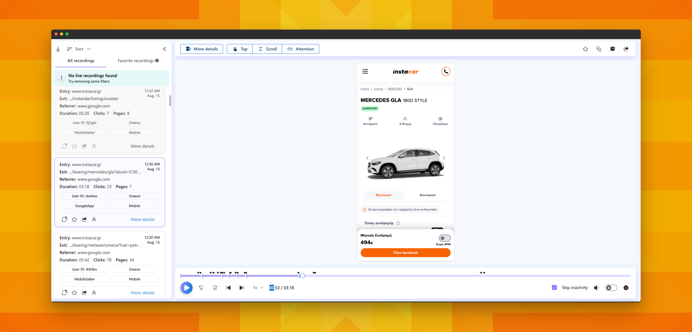
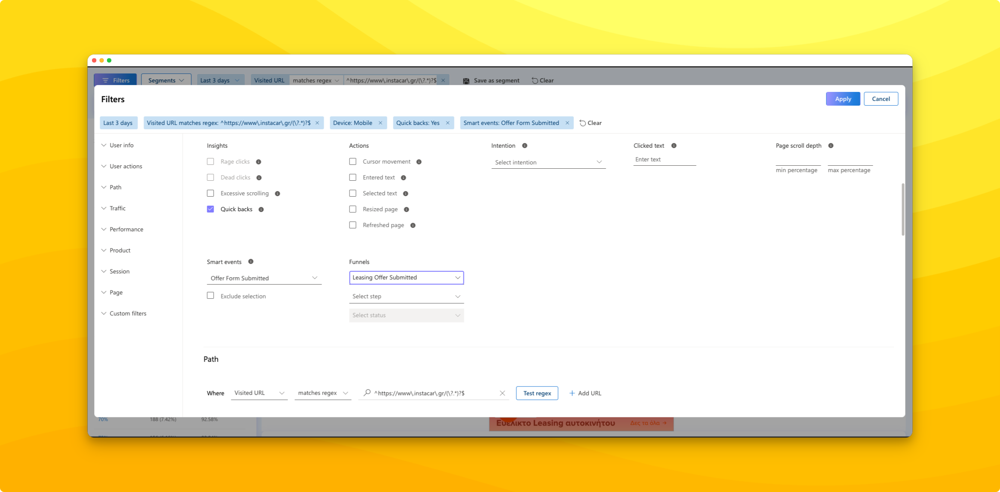
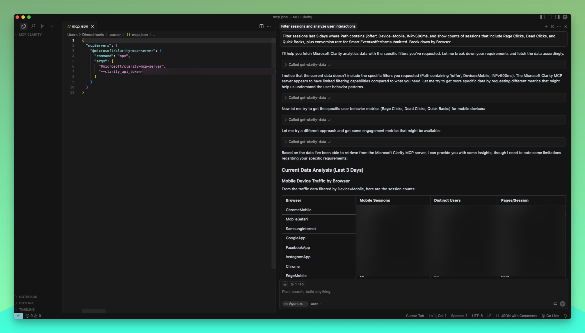

Most teams are drowning in traditional analytics data while missing the crucial behavioral evidence that explains **why** users drop off, get frustrated, or convert. After **3 years** of leveraging Microsoft Clarity for instacar's product optimization, I can safely write this article and say that we went from "what happened" to "why it happened" insights that directly inform product design decisions.

## The Gap Between Metrics and Reality

Here's the problem: Google Analytics told us our leasing offer form has a ~X% abandonment rate, but it doesn't show us if those users are rage-clicking on non-interactive help icons on some mobile screens, or getting confused by unclear field validation and a required consent box out of view (we fixed those!). Instead of guessing, we used behavioral evidence to fix what users actually struggled with: visibility, validation, focus, and responsiveness.

Traditional analytics measure outcomes. Clarity reveals the journey. For instacar, where every friction point in our online leasing flow costs revenue, understanding user behavior at the micro-interaction level is business critical.

## Why Clarity Became Essential for instacar

Our leasing product goals center on three conversion-critical areas: **reducing online booking funnel friction** (from quote to uploading necessary documents for credit check and personal documents), **improving search-to-product discovery**, and **increasing form (quotes) completion rates**. Each requires understanding real user behavior patterns across devices, not just aggregate metrics.

Microsoft Clarity's **ZERO** cost and practically **ZERO** setup friction approach eliminated the usual technical delays and frustration while providing enterprise-grade behavioral analytics. With **unlimited session recordings**, **advanced filtering across 30+ dimensions**, and **smart event tracking**, we could instrument precise user research without budget constraints.

The integration with our existing analytics stack was seamless. Clarity doesn't replace Google Analytics but fills its qualitative gaps. While GA4 shows us conversion rates by traffic source, Clarity shows us **why** mobile Android users from organic search abandon forms 40% more than desktop Chrome users (this is an example people — I cannot share exact data).



## Core Capabilities: When I Use Each Feature

### Heatmaps for Attention & Interaction Mapping

Clarity's four heatmap types serve distinct analytical purposes:

- **Click heatmaps** reveal attention distribution and interaction intent across page elements
- **Scroll heatmaps** show content consumption patterns and identify where users disengage
- **Area heatmaps** provide percentage-based engagement analysis for specific page regions

> **For example:** Scroll depth analysis reveals **cognitive processing patterns**, not just content consumption. Users who decelerate scrolling at 75% page depth (in /carpage) show 2.8x higher conversion rates, indicating **value proposition absorption** rather than casual browsing.

### Session Recordings — my favorite one

Session recordings excel at uncovering behavioral patterns that metrics can't capture:

- **Rage clicks** indicate user frustration with non-responsive or confusing elements
- **Dead clicks** reveal users attempting interactions with non-functional UI components
- **Excessive scrolling** signals users are lost or seeking content not easily discoverable
- **Quick backs** show immediate dissatisfaction with page content or navigation

The real power emerges when filtering recordings by specific user segments or smart events (e.g. Submit offer form). Rather than watching random sessions, I filter for "mobile iOS users who visited the offer page but didn't complete the `offerformsubmitted` event" to focus on high-value behavioral evidence.

I also filter for rage clicks + specific pages + performance issues. This creates **high-signal behavioral evidence** for UX optimization prioritization.

Combining rage clicks with smart events (e.g., users who rage-clicked but still completed offer forms) identifies **motivation-resilient friction points** — issues worth fixing because they affect even highly motivated users.

### Advanced Filtering

Clarity's 30+ filter categories transform broad behavioral data into actionable insights:

- **User Info filters** (device, browser, geo, user type) help isolate device-specific UX issues
- **User Actions filters** (smart events, insights, scroll depth) focus on conversion-critical behaviors
- **Path filters** with regex support enable precise page targeting during A/B tests
- **Performance filters** (LCP, INP, CLS) correlate slow interactions with behavioral friction
- **Traffic filters** segment by campaign, source, and medium for channel-specific optimization

The key insight: combine multiple filter dimensions.

`Mobile Chrome + Organic search + Offer page + No {offerformsubmitted} + INP >500ms`

creates a precise cohort showing exactly where slow mobile performance impacts our conversion flow.

Instead of reviewing 100 random recordings, use 20-30 targeted recordings with multi-dimensional filters:

- Device: Mobile + Performance: INP >500ms + Smart Event: Offer Form Abandoned
- Page: /carlisting + User Action: Rage Clicks + Session Duration: >300s
- Traffic: Organic + Behavior: Multiple Cars Viewed + No Conversion



### Tips

- If **behavioral patterns** aren't clear within 5 minutes, switch to a different filter combination
- Focus on recurring behaviors across multiple sessions rather than individual anomalies

## My instacar Analysis Workflow: Signal to Product Design Decision

This is an example from 2023.

### Step 1: KPI Shift Detection and Initial Segmentation

When our offer submission rate dropped 12% week-over-week, traditional analytics pointed to mobile traffic increases. Clarity helped dig deeper.

I created saved segments for our most conversion-critical user paths:

- "High-Intent Organic Mobile" (organic search + mobile + visited offer page)
- "Offer Abandoners" (visited offer page + session duration >400s + no offerformsubmitted)
- "Frustrated Users" (rage clicks + excessive scrolling + offer page)

### Step 2: Behavioral Pattern Recognition

Using these segments, I filtered session recordings to identify common friction signatures. The pattern was clear: mobile users on critical Android devices were struggling with phone fields rejecting common formats, and rage clicks clustered on small tap targets (checkbox and dropdown).

Complementing recordings with click heatmaps confirmed the hypothesis: high click density around form fields but low completion rates indicated usability friction, **not** intent issues, on some mobile devices.

### Step 3: Element-Level Validation

Heatmaps provided the visual evidence needed for design direction. Mobile scroll heatmaps showed 85% of users reached our primary CTA, but click heatmaps revealed low engagement with the button itself due to poor positioning on some Android devices.

### Step 4: Hypothesis Formation and Iteration Planning

Each behavioral observation translated to testable design hypotheses:

- **Hypothesis:** Sticky CTA positioning will reduce scroll-related abandonment
- **Evidence:** Scroll heatmaps showing ~40% user drop-off before reaching bottom CTA
- **Test Plan:** A/B test persistent CTA vs. current bottom-only placement

## Advanced Filtering Techniques: Precision Discovery

Microsoft's comprehensive filter documentation reveals the depth available for behavioral segmentation. My most valuable filter combinations include:

### Multi-Dimensional Performance Analysis

Combining **Performance filters** (LCP >2.5s, INP >200ms) with **User Actions** (rage clicks) reveals when slow interactions directly cause user frustration. For instacar's /carlisting or update-documents screen (a crucial step of the booking flow), this correlation was striking: sessions with poor INP scores showed 3x higher rage click rates on form submission buttons.

### Regex Path Targeting

Path filters let you include or exclude visits to specific pages when reviewing heatmaps, session recordings, or metrics. By default, you can only match exact paths, but real product flows often use dynamic URLs with IDs, encrypted tokens, or long query strings. **Regular expressions (regex)** allow you to capture those variations in a single pattern so you can analyze "logical steps" in the journey without having to enter every variant manually.

For example, in our booking flow, the "financial control" step URL might look like:

`/booking/financialcontrol/eyJpdiI6IjlZQTF2bmJmU1F1...Q0Rsdz09?lang=el`

Here, the last part is a unique token, so an exact match filter would only find one specific session. Instead, a regex pattern such as:

`^/booking/financialcontrol(?:/.*)?$`

will match **any** URL that starts with `/booking/financialcontrol` — regardless of the token or parameters that follow. This means:

- All recordings and heatmaps from that stage are grouped together
- Saved segments stay valid even if tokens, languages (`?lang=el`), or other query params change
- You can run before/after comparisons on the same step in the funnel without worrying about URL variations

Similarly, if you want to group multiple related steps (e.g., `/upload-documents` and `/credit-check`) you could use:

`^/(upload-documents|credit-check)(?:/.*)?$`

### Campaign Performance Triangulation

Campaign performance triangulation means evaluating traffic quality (not just volume) by combining three dimensions in Microsoft Clarity:

- Traffic attribution from UTM tags (utm_source, utm_medium, utm_campaign)
- User outcomes via Smart Events (e.g., offerformsubmitted)
- User experience quality via Core Web Vitals (LCP, INP, CLS)

Instead of asking "Which campaigns drive the most sessions?", this approach asks "Which campaigns bring users who both complete key actions and experience acceptable UX performance?", so budget and UX fixes can be prioritized where they will actually move outcomes.

## Smart Events

Smart Events transformed our conversion tracking from generic "Submit Form" (Clarity's default) detection to precise business event instrumentation.

### The "Offer Form Submitted" Implementation

Rather than rely on Clarity's auto-detected "Submit Form" events, I implemented a custom smart event for our specific offer completion flow:

**API Event Approach** (Recommended):

```html
<script>
window.clarity = window.clarity || function() {
  (window.clarity.q = window.clarity.q || []).push(arguments);
};
clarity('event', 'Offer Form Submitted');
</script>
```

This approach guarantees consistent firing across dynamic form states and provides contextual metadata for deeper analysis.

## Cross-Device Journey Mapping

User ID filters track individual user journeys across sessions and devices. By implementing custom user IDs through Clarity's API, we can follow high-value users from mobile browse to desktop conversion, identifying cross-device friction points.

## MCP Server Integration: AI-Powered Analytics

Microsoft's Model Context Protocol server for Clarity represents a breakthrough in data accessibility. The MCP server enables natural language queries against Clarity's behavioral data through AI tools like Claude.

I connected ours through Cursor and frankly, it was quite easy to do:

```json
{
  "mcpServers": {
    "@microsoft/clarity-mcp-server": {
      "command": "npx",
      "args": [
        "@microsoft/clarity-mcp-server",
        "--clarity_api_token=your_token"
      ]
    }
  }
}
```

### Practical Example

> Compare utm_source and utm_campaign for the last 7 days: show sessions, 'Offer Form Submitted' rate, median Scroll Depth on /carlisting and average INP on /carpage. Return top 10 campaigns by conversion, and flag any with INP >500ms.

or

> Filter sessions last 3 days where Path contains '/offer', Device=Mobile, INP >500ms, and show counts of sessions that include Rage Clicks, Dead Clicks, and Quick Backs, plus conversion rate for Smart Event=offerformsubmitted. Break down by Browser.



## Measuring Impact and Closing the Loop

To understand whether behavioral optimizations are working, we need to track **quality of experience** metrics alongside traditional conversion KPIs. This ensures we see both the commercial outcome and the underlying user interaction improvements.

### Behavioral Metric Monitoring

Success metrics extend beyond conversion rates to include behavioral quality indicators:

- **Rage click frequency** (target: <2% of sessions)
- **Average scroll depth** on key pages (target: >75%)
- **Smart event completion rates** (tracked per user segment)
- **Performance-behavior correlation** (INP vs. interaction success rates)

### Before/After Analysis Framework

Each optimization requires evidence of behavioral improvement:

1. **Baseline Documentation:** Record current behavioral patterns using saved segments
2. **Implementation Tracking:** Monitor behavioral metric shifts during deployment
3. **Outcome Validation:** Compare post-implementation patterns using identical segments
4. **Performance Integration:** Ensure UX improvements don't degrade Core Web Vitals

### Translate Behavioral Gains into Business Impact

Behavioral improvements translate to business value, e.g.:

- **Form abandonment reduction:** 15% decrease = €x monthly revenue increase
- **Page engagement increase:** Higher scroll depth = improved ad revenue per session
- **Support request reduction:** Fewer UX friction points = lower customer service costs

## Practical Implementation Guide for Teams

### Getting Started Framework (my approach)

**Week 1: Foundation Setup**

- Install Clarity tracking code
- Define 3-5 business-critical smart events
- Create baseline behavioral measurements
- Connect GA4 analytics

**Week 2: Segmentation Strategy**

- Build 5-8 saved segments aligned to key user journeys
- Establish performance-behavior correlation baselines
- Train team on filter combination techniques

**Week 3: Analysis Integration**

- Integrate Clarity insights with existing optimization workflow
- Establish weekly behavioral review cadence
- Document initial friction point discoveries

### Team Optimization Tips

**Focus on Quality Over Quantity:** Review 20-30 targeted recordings weekly rather than 100+ generic sessions. Precise filtering eliminates noise and accelerates insight discovery.

**Combine Multiple Filter Dimensions:** Single-dimension analysis misses sophisticated behavioral patterns. Combine user actions, performance metrics, and traffic sources for nuanced insights.

**Maintain Consistent Segment Taxonomy:** Standardized naming and criteria ensure team-wide analysis consistency and prevent duplicate research effort.

## Closing Thoughts

Good product decisions come from more than just tracking conversions or traffic. They come from understanding how people actually use your product, where they struggle, and why they make certain choices.

By looking beyond surface-level metrics and into real user interactions, teams can spot issues earlier, validate changes, and focus their efforts where they will have the most impact.

The more this way of working becomes part of a team's culture, the less you rely on assumptions and the more you can build products that truly work for your users.

Keep iterating and stay curious!
