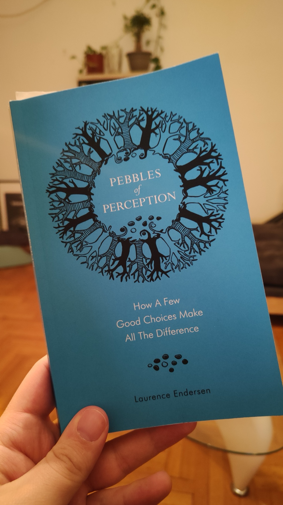

In Laurence Endersen's book *Pebbles of Perception*, second-level thinking is a method that goes beyond the obvious. It involves probing deeper into the first reactions or answers we have about a situation. This kind of thinking requires skepticism, not cynicism, allowing for a more nuanced understanding.

Endersen describes first-level thinking as the immediate and visible layer of thought — the straightforward and often superficial answer to a problem. Second-level thinking, however, challenges us to consider the 'what else': the underlying factors and implications that aren't immediately apparent.

In product management, this second-level thinking is invaluable. For example, when faced with negative user feedback, a first-level thinker might rush to make superficial fixes. A second-level thinker would instead dive into the feedback loop, seeking to understand the root causes behind the feedback. They might integrate user behavior analytics, contextual inquiries, and A/B testing to discern whether the feedback is symptomatic of a deeper usability issue or a misalignment with user expectations.

We're reminded of the importance of observation and reflection in truly knowing our subject matter. As Endersen articulates:

> Knowing the name of something in various languages is not the same as understanding its essence.

So let's embrace the spirit of second-level thinking. It's a potent reminder that in the quest for knowledge and improvement, the questions we ask are just as important as the answers we seek. And it's through this lens of deep curiosity that we can craft products, strategies, and solutions that truly resonate with the complexity and richness of the human experience.

Keep iterating and stay curious.

