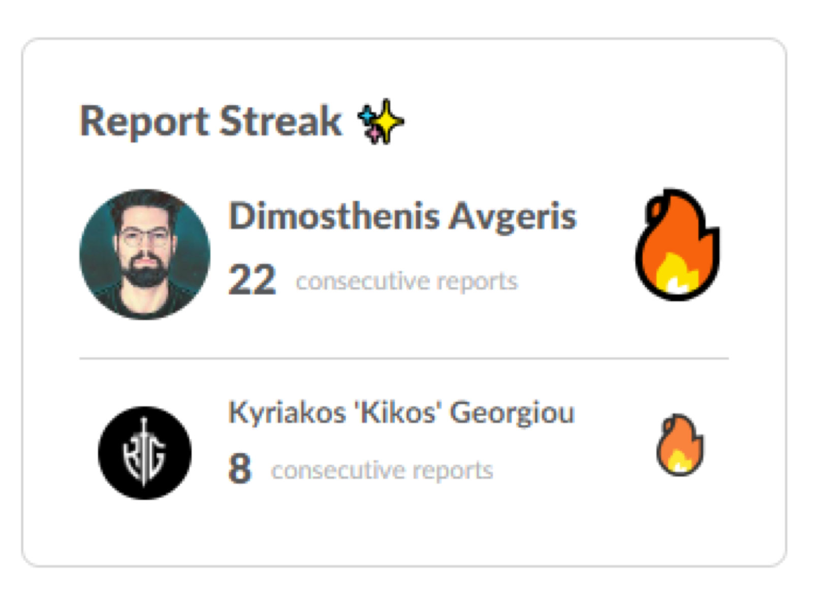

Daily standups have long been popular in team management for their ability to improve communication and effectiveness. Some studies suggest that effective daily standups can improve team cohesion by up to 50% and remove blockers to progress (see the [Atlassian Agile Coach](https://www.atlassian.com/agile/scrum/standups)).

However, early-morning meetups — even 15 minutes — can be more disruptive than beneficial for some team members. Opinions on productivity and time of day are far from unanimous. While plenty of studies (and some urban legends) swear that mornings are peak productivity hours, that's not the full story. Some neuroscientists, like those featured on the Huberman Lab channel, argue that mornings are best suited for tactical, focused tasks, whereas evenings can be more conducive to creative thinking and problem-solving. So the "best" time of day might just depend on the type of work you're doing.

With the hypothesis that early standup meetings might actually be counterproductive for product and tech people, we decided to explore different options. Another nudge in this direction was the "mood" factor: newer generations tend to hate mornings more and more, and since most of instacar's tech and product team are pretty young, this backed up the hypothesis. So we decided to experiment with Geekbot, aiming to retain the benefits of daily standups while ditching some of their downsides.

Geekbot takes the standup concept and makes it asynchronous and text-based. It works through Slack, and each morning asks us to answer two questions:

1. What project are you working on today?
2. Do you have any blockers?

Data-wise, blockers are down by ~20% within the first month of switching to Geekbot. [Linear](https://linear.app/) provides some clean dashboards to keep track of the team's progress. All these standup notes are saved, so I can review them within Geekbot's reports tab at my own pace. I get a real-time look at what's happening without having to intrude on anyone's workflow.

In a nutshell, Geekbot hasn't just replaced our daily standups — it's elevated them. Our team is getting progressively more effective, and our mornings? They're just better.

PS. I'm the current king 😂 of report streaks (de-throning Kyriakos from a consecutive 33 reports).

