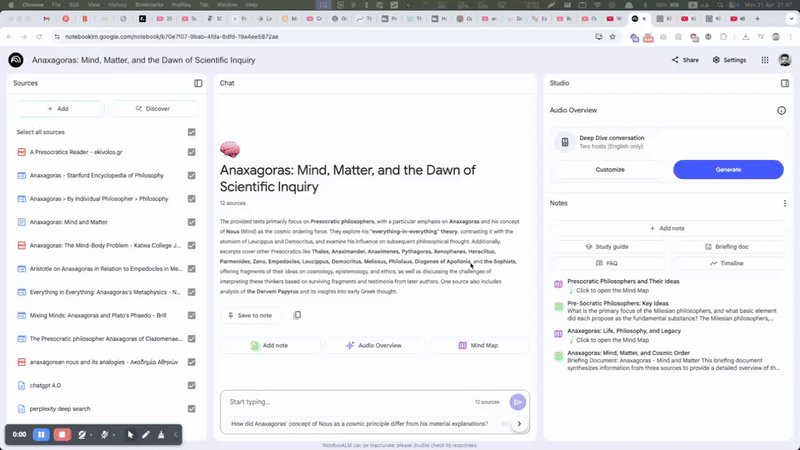

## Intro

When it comes to learning new things, I use a simple, flexible approach that fits into my day-to-day life, whether I'm digging into a new product concept, preparing for a big meeting, or exploring a topic out of pure curiosity.

This isn't some secret formula. **It's just what's worked for me.**

Here's how it usually looks.

## The Problem With Research Today

Research is messy. Information is scattered. Different AI models have different strengths and weaknesses.

If you rely on a single source, even a powerful one, it's possible that you're falling into the single-source bias trap.

That's why I try to follow a more practical stack that helps me get a broader, deeper view instead.

### Step 1: Start With a Precision-Targeted Prompt

Everything begins with a clearly framed prompt. I start with a **simple** but **detailed prompt** that defines exactly what I'm looking for.

When I wanted to learn more about Anaxagoras (a Greek philosopher), my starting point looked like this:

> Who was Anaxagoras? What were his main philosophical and scientific contributions, especially regarding his concept of "Mind" (Nous) and his physical theories such as "everything-in-everything"? What specific works or writings are attributed to him, and what fragments or sources of his work are available today? Please provide a detailed explanation of his ideas, historical context, and influence, and include references or links to primary sources and reputable secondary resources for further study. Additionally, explain how his ideas relate to modern discussions about intelligence or artificial intelligence.

Being specific helps later when comparing results across different models.

### Step 2: Run the Prompt Across Multiple LLMs

One model's view isn't enough. I run the *same* prompt across different AI tools:

- **ChatGPT (deep research)** → usually strong on academic and structured knowledge
- **Perplexity (Sonar)** → pulls in fresh web data and often cites sources
- **Gemini (discovery)** → usually strong on academic and structured knowledge
- **Grok** → sometimes catches unconventional ideas others miss

Each model brings something different to the table: different citations, different ways of organizing information, even different blind spots. I treat them all like different advisors sitting at the same table.

### Step 3: Capture Everything Separately

I don't cherry-pick what I like. For example:

- ChatGPT emphasized Anaxagoras' concept of *Nous* (Mind) as a cosmic ordering force.
- Perplexity surfaced a recent article questioning traditional interpretations.
- Gemini framed Anaxagoras more as a precursor to scientific thinking.

I save ***all*** the outputs, clearly labeled by which model they came from. Even if something looks redundant or messy at first, I want the full raw material to work with later.

### Step 4: Consolidate in NotebookLM

This is where it gets interesting.

I upload everything into **NotebookLM:** the outputs from all the models, plus any PDFs, video transcripts, saved articles, or my own handwritten notes.

NotebookLM turns this mess into a **queryable knowledge base**. It's not just storage, it's active. I can ask it questions like:

- "Where do the different models agree or disagree on Anaxagoras' main ideas?"
- "Summarize Anaxagoras' concept of *Nous*."
- "List three historical figures directly influenced by Anaxagoras."

It's like having an ongoing conversation with your entire research stack, without needing to dig manually through notes.

## Why This Works (Especially for Deep Topics Like Anaxagoras)

Here's why this system works, at least for me:

- **Multiple LLMs** give me a broader range of perspectives.
- **Mind mapping** gives me a structure to organize and connect complex ideas visually.
- **NotebookLM** turns passive notes into an active, dynamic library I can keep questioning.
- **Audio and rewriting** help move ideas from short-term memory into long-term understanding.

## Visualizing the Process

I really like the mind map feature. Seeing everything visually makes complexity easier to handle.

## Final Thoughts

At the end of the day, tools are just tools. What matters is whether they help you think better, decide faster, and build deeper knowledge.

For me, this approach works because it's:

- Simple enough to use regularly
- Flexible across different topics
- Strong against blind spots and single-source bias

## TL;DR

Clear prompt → Multiple LLMs → NotebookLM → Mind Map → Query notes → Keep learning.

**Keep iterating and stay curious!**
