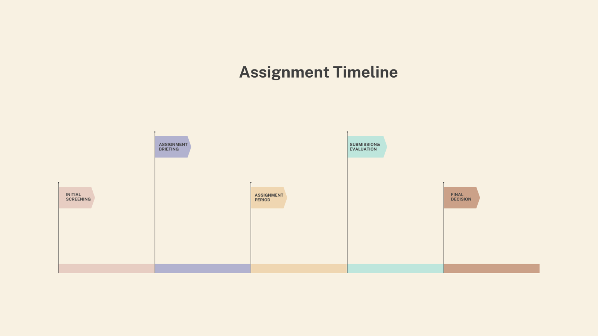

Hiring the right PM is a critical task, especially in a startup or scale-up environment where every role is pivotal and resources are limited. Assembling marketing teams over my career has given me some valuable insights into the hiring process. But when the time came to hire my first Product Manager at instacar, I knew I needed a different approach. Let's call it "The Ledger Assessment Method".

The process took just one week and came out of a conversation with my friend K. Giamalis. The concept was simple but powerful: why not have candidates build or replicate the core of a product we already use? This tests not only their technical skills but also their ability to think critically and strategically.

In our case, the candidate is asked to replicate or build the core of a fleet management app — similar to our internal tool, Ledger, which is already used by our teams. The focus isn't on the technology used or how closely it resembles Ledger, but on the candidate's thought process and understanding of core product entities.

But why did I choose this method?

## Advantages

1. **Encourages creative thinking:** the open-ended nature of the task lets candidates think outside the box.
2. **Easy to evaluate:** the focus on core entities and functionalities makes it straightforward to assess a candidate's understanding of product management.
3. **Real-world relevance:** the task closely mimics the challenges a PM would face in a real scenario.

## Limitations

1. **Time-consuming:** the assessment can be time-intensive for both the candidate and the evaluator.
2. **Not everyone's cup of tea:** some candidates are averse to written assessments — though one could argue this is a necessary skill for a PM role.

The assessment had both similarities and differences compared to our live product, Ledger. What stood out was how easy it was to evaluate candidates based on their critical thinking skills.

We evaluated submissions on a few key criteria: understanding of core product entities, thought process, and the logical flow of functionalities. Interestingly, the technology used was not a factor, which made the assessment more inclusive for candidates from diverse tech backgrounds. It was quite easy to spot who had given the task thoughtful consideration and who had rushed through it.

This was the first time I executed this idea, and it proved to be an effective way to gauge critical thinking. It's a method I'd recommend to any product manager looking to hire someone capable of building internal tools.
