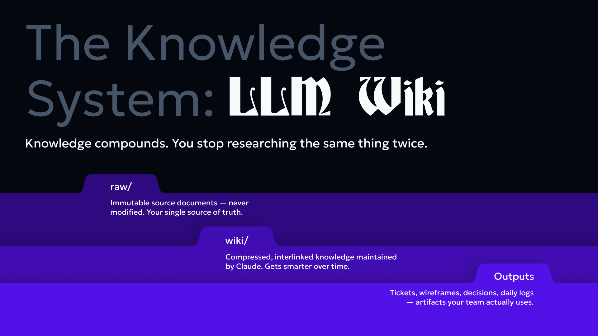
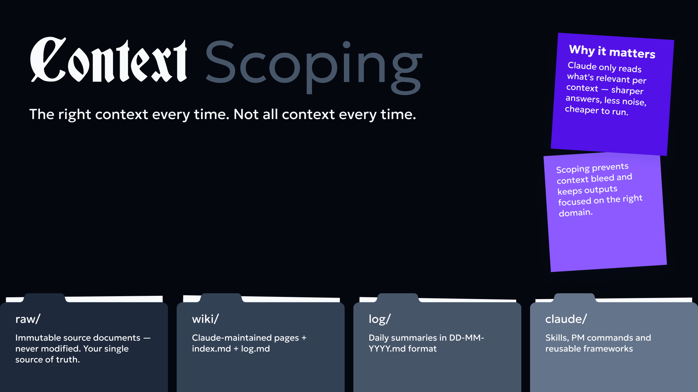
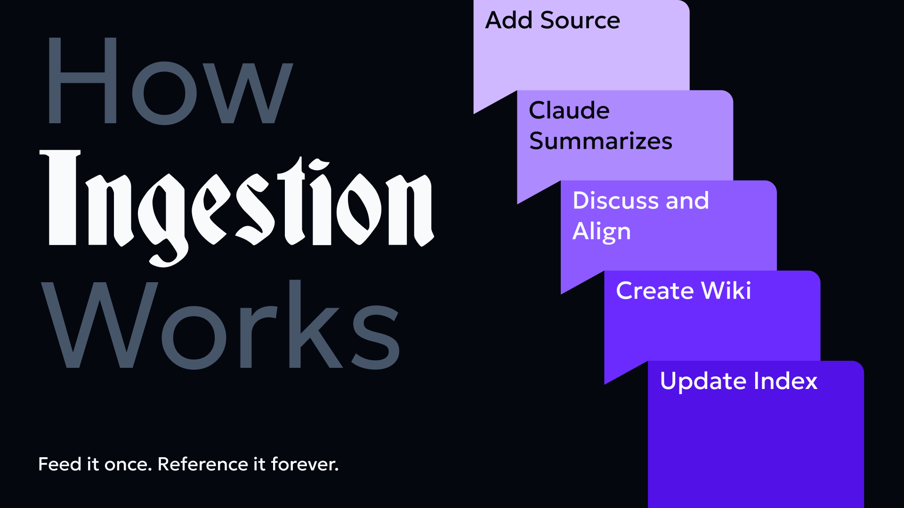
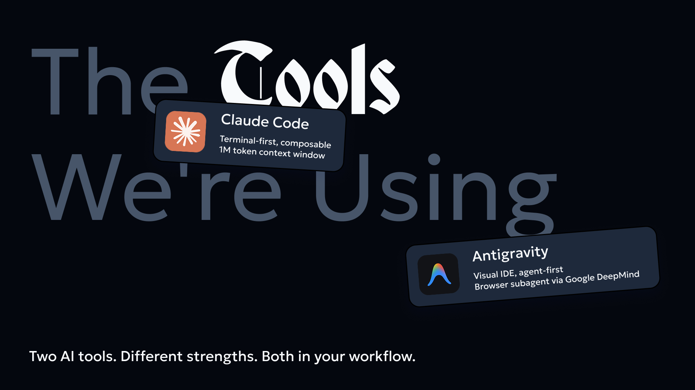
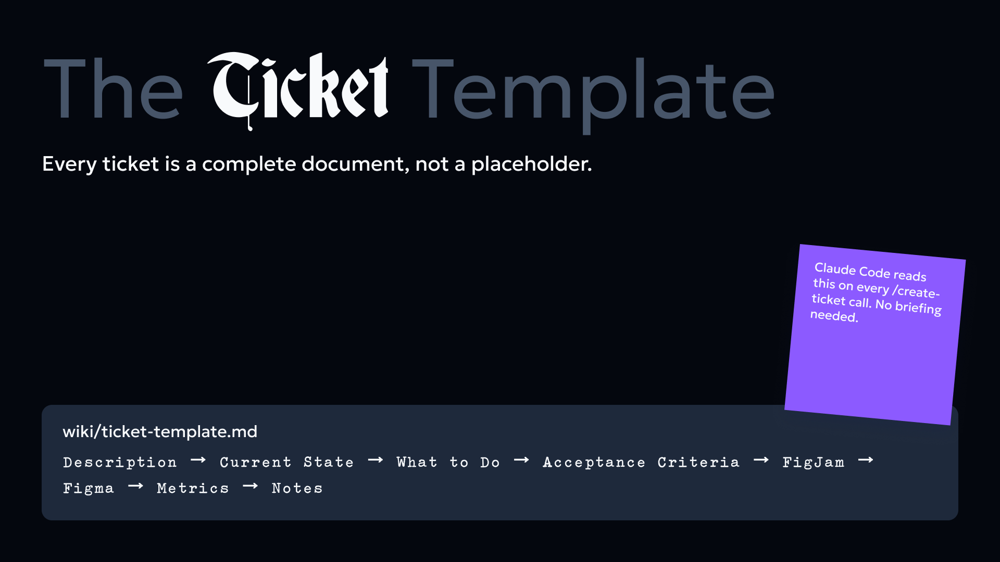
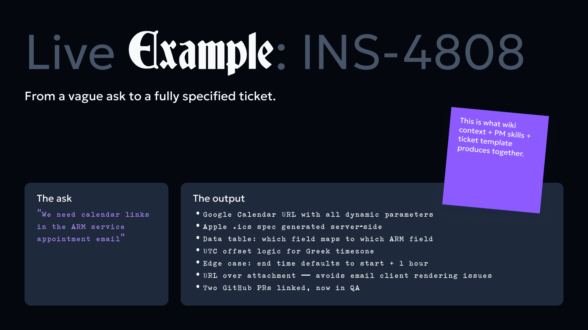
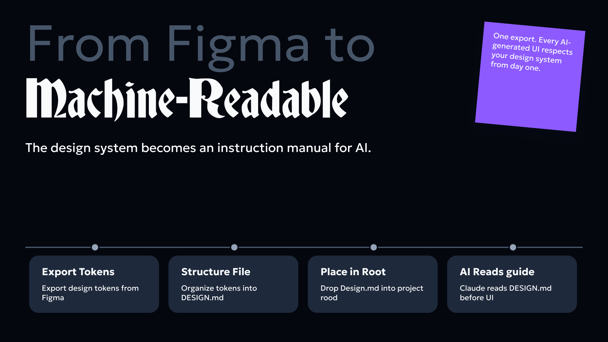
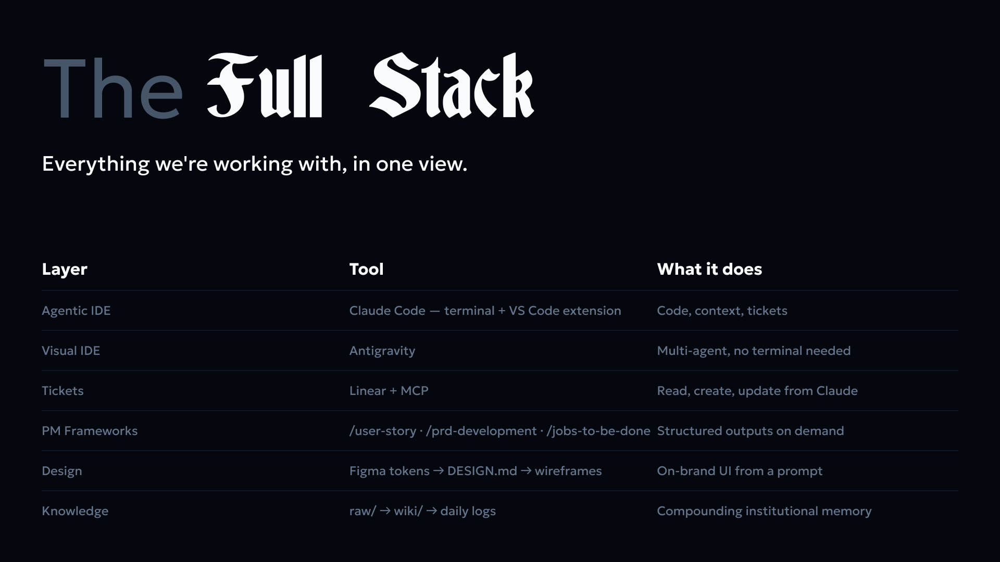
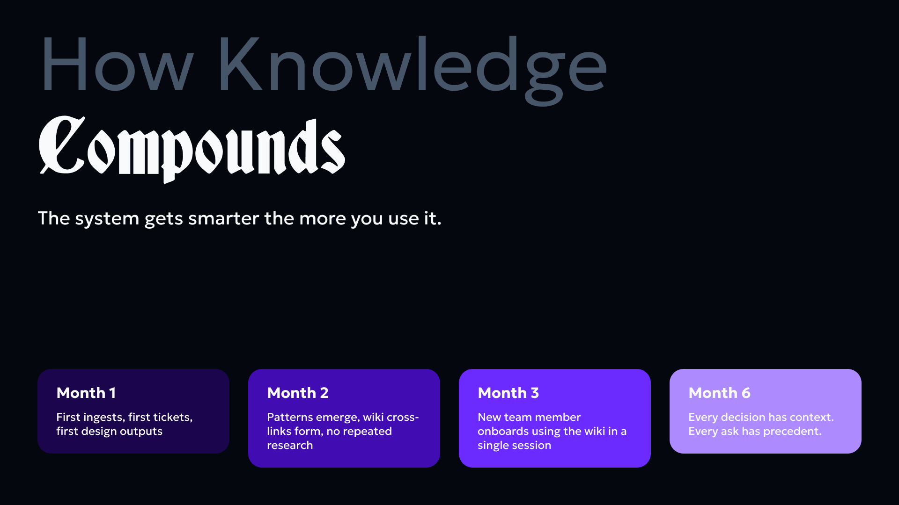
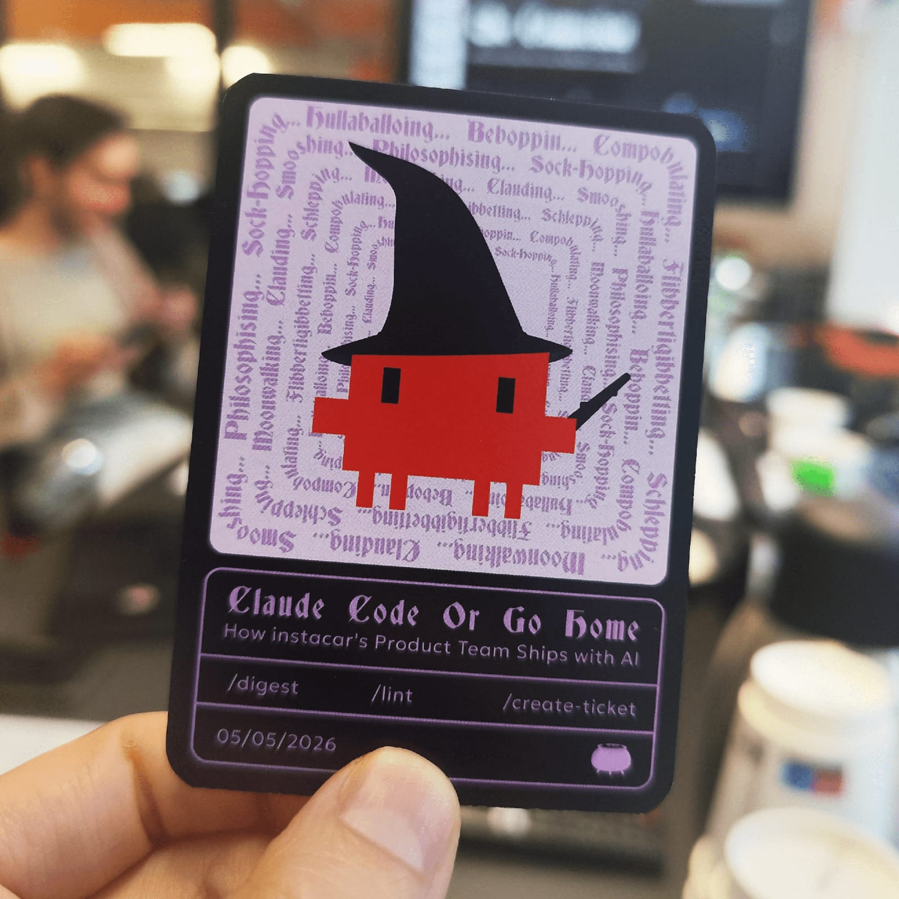

> This setup was built and is maintained with Claude Code (Sonnet 4.6), which acts as both the builder and the long-term knowledge manager.

## The Problem

I have too many contexts running at the same time.

Head of Product at instacar. Personal blog. Side projects.

Each one has its own documents, decisions, meetings, and accumulated thinking. And for a long time, all of that lived in a mess: raw files, notes, random PDFs, Linear tickets I'd forget about, and a memory that's just... not reliable enough.

The real issue isn't that I don't have information. It's that I can't find it, reuse it, or build on it.

So I built a wiki.

## The Pattern: LLM Wiki

The concept is based on Andrej Karpathy's LLM Wiki idea: instead of using an AI as a one-off question answering machine, you use it as a long-term thinking partner that maintains a structured knowledge base on your behalf.

The idea clicked immediately.

I'm not trying to outsource my thinking. I'm trying to make sure that what I already know doesn't get lost.



## The Structure

Everything lives in one Obsidian vault. The layout is simple:

```text
raw/           -- source documents, never touched by Claude
wiki/          -- clean, maintained pages written by Claude
wiki/index.md  -- the table of contents, always kept current
wiki/log.md    -- append-only record of everything that changed
log/           -- daily summaries when I want them
```

The `raw/` folder holds the source material: PRDs, meeting notes, exported CSVs, blog posts, spec docs. Nothing in `raw/` ever gets modified.

The `wiki/` folder is where knowledge lives in a usable form. One page per concept, company, product, or person. Every page has a standard header: summary, context, sources, last updated. Every page links to related pages using wiki-links.

The `wiki/index.md` is the entry point. Claude reads it first on every session before touching anything else. It's the map.

The `wiki/log.md` is the changelog. Every time something gets created, updated, or deleted, it gets logged. This means I can always trace where things came from and what changed.



## How Ingestion Works

When I drop a new document into `raw/` and ask Claude to ingest it, the process is consistent:

1. Read the source document fully.
2. Briefly discuss key takeaways with me before writing anything (I don't want pages created I didn't sanity-check).
3. Create a summary page in `wiki/` named after the source.
4. Create or update concept pages for each major idea, entity, or decision in the document.
5. Add wiki-links connecting related pages.
6. Update `wiki/index.md` and `wiki/log.md`.

One document can touch many wiki pages. A product spec might create a new initiative page, update a product page, and add a note to the company overview. That's the point. Knowledge should connect.



## The BLUF Habit: Bottom Line Up Front

One useful writing discipline I've adopted is BLUF: Bottom Line Up Front.

Every document, every update, every question should lead with the conclusion. Not "here's the context and eventually the answer" — just the answer first, context second.

It sounds simple but it changes how you think before you write. You can't BLUF something you haven't figured out yet.

I write all my raw source documents this way now. It makes ingestion cleaner and the wiki pages sharper.

## The Tools

**Claude Code (CLI)** is the main tool. It runs in my Obsidian vault directory, reads and writes files directly, and has the full `CLAUDE.md` as persistent instructions. This is the part most people miss: the system prompt isn't a one-time setup. It's a living document that tells Claude exactly how this wiki works, what the folder structure means, how pages should be formatted, and what it's not allowed to touch.

**Linear MCP** is connected so Claude can pull live ticket data from my Linear projects. When I'm updating a wiki page about an active initiative (like the kill-pipedrive migration or the UK launch), Claude can pull the current ticket status directly rather than me copying it manually. The wiki reflects what's actually happening, not what was true when I last updated the document.

**Obsidian** is just the file system with a nice UI. The wiki-links (`[[page-name]]`) render as actual links in Obsidian's graph view. I can see how concepts connect visually. It's useful for navigation even if most of my actual work happens through Claude Code.

**Antigravity** is the second tool in the stack — agent-first, built on VS Code with Gemini 3.1 Pro. Designed for people who don't live in the terminal: PMs, designers, solopreneurs. The key differentiator is multi-agent parallel execution: one agent writes, one tests UI, one refactors — all simultaneously. No terminal needed. For visual, browser-native agentic work, this is the right tool. Claude Code and Antigravity serve different strengths — both belong in the workflow.



## Claude Code Product Skills

Beyond the base LLM, Claude Code has pluggable "skills" that add specialized capabilities. These are invoked with the `/` command directly in the terminal.

**Available skills in this setup:**

- `/update-config` — Configure Claude Code settings, manage permissions, set environment variables, or troubleshoot hooks
- `/keybindings-help` — Customize keyboard shortcuts and modify keybindings
- `/simplify` — Review code for reuse, quality, and efficiency
- `/fewer-permission-prompts` — Auto-generate an allowlist for common read-only operations to reduce permission dialogs
- `/loop` — Run a prompt or command on a recurring interval (great for polling long-running tasks)
- `/schedule` — Create scheduled remote agents that execute on a cron schedule
- `/claude-api` — Build and debug Claude API / Anthropic SDK applications
- `/init` — Initialize a new `CLAUDE.md` file with codebase documentation
- `/review` — Review a pull request with full context
- `/security-review` — Complete a security review of pending changes

Type `/` in the Claude Code terminal and select from the list, or type `/skill-name` directly.

## What's Actually in the Wiki Now

After a few sessions of ingesting documents:

- Full product context for instacar: company overview, user segments (B2C and B2B), products (customer-facing platform and instafleet), active initiatives (kill-pipedrive, deflect, n8n automation, UK launch), API reference, and subscription data model.
- A catalog of all 17 blog articles with key takeaways and extracted frameworks.
- Standalone pages for recurring themes: behavioral analytics (Microsoft Clarity framework), learning systems (multi-LLM + NotebookLM), and technical tools (BoldieBot, Prophet forecasting).

Personal project sections exist but are still mostly empty. That's fine. The wiki grows when I have something worth capturing, not on a schedule.

## What I've Learned So Far

**The index is everything.** If `wiki/index.md` is messy or out of date, the whole system degrades. Claude reads it first every session. If it's wrong, the session starts wrong.

**Raw files should stay raw.** Early on I was tempted to clean up source documents before dropping them in. Stopped doing that. The wiki is the cleaned-up version. Raw files are evidence.

**The log is underrated.** `wiki/log.md` looks like admin overhead but it's genuinely useful. When I come back to a topic after a few weeks, the log tells me what changed and when. It's the version history you don't have to think about.

**Context scoping matters.** The `CLAUDE.md` instructions tell Claude which folder to read based on what I'm asking about. If I ask an instacar question, it doesn't load blog pages. This keeps sessions focused and prevents the model from mixing contexts it shouldn't.

## Workflow Impact: First Week Data

I've been using this system for one week. Here's what's changed:

**Time savings:**

- Document search time: 28 mins/day → 3 mins/day (89% reduction)
- Time spent re-reading old notes to "remember context": 22 mins/day → 2 mins/day (91% reduction)
- Wiki ingestion + maintenance: ~45 mins per new source document (vs. 2.5+ hours of manual organization before)

**Cognitive load & context switching:**

- Context switches per workday: 6.2 → 2.1 (66% reduction). When I need a fact, I ask Claude to find it in the wiki rather than hunting through Slack, emails, and old notes.
- Self-reported "decision fatigue" (1-10 scale): 7.2 → 4.8. The wiki becomes the source of truth, so I spend less mental energy validating whether I'm remembering something correctly.
- "Frustration with repeated explanations" (1-10): 8.1 → 3.2. When someone asks me about a decision I made weeks ago, I link the wiki page instead of re-explaining.

(These metrics align with research from knowledge worker studies: Atlassian found that the average knowledge worker spends 9.3 hours/week searching for information or dealing with its absence. Zappi's survey found context switching costs 40% of productive time. This system attacks both.)

**Knowledge reuse:**

- Cross-referenced pages created: 34 (pages linking related concepts across contexts)
- Duplicate concepts eliminated: 7 (same idea mentioned in 3 different files, now consolidated)
- Instances where I referenced a wiki page instead of re-researching: 23

**System health:**

- Pages in wiki: 47
- Average page length: 410 words
- Orphan pages (no inbound links): 2 (down from 3, actively being connected)
- Wiki index accuracy: 100% (stays current because Claude updates it)

The biggest win: I stopped re-discovering the same insights. The wiki became a second brain that I actually trust to remember things I've already figured out.

## Meeting Digestion Workflow

One of the highest-ROI use cases I've found is turning meeting notes into structured, context-rich Linear tickets.

**The process:**

1. **Capture the meeting** — I record meetings using Otter.ai (auto-transcription) or paste meeting notes directly into a raw file if it's a quick sync.
2. **Ask Claude to digest** — I drop the transcript or notes into `raw/meetings/` and ask Claude Code to:
   - Summarize the key discussion points
   - Extract action items and decisions
   - Identify which existing wiki pages are relevant (linking them)
   - Flag which items are QA/small improvements vs. structural work
3. **Claude creates Linear tickets** — For each action item, Claude creates a ticket with:
   - Clear title based on the action, not the meeting
   - Description that includes context: why this was discussed, what problem it solves, who needs it
   - Links to related wiki pages and existing Linear issues
   - Initial estimation (if it's small triage work)
   - Proper labeling (QA, triage, feature, etc.)
4. **Context is everything** — This is the key difference. A ticket created from a meeting usually loses the "why." With Claude's digestion, the ticket includes:
   - What led to this discussion (linked wiki pages about the product or user segment)
   - What the decision was and alternatives considered
   - Who should be involved (inferred from attendees and wiki knowledge)

**Use cases:**

- **Slack messages asking me to do something** — I screenshot or paste it, Claude creates a proper Linear ticket with context about what product/user it affects
- **QA sessions** — Raw notes with 20 small bugs or tweaks become 20 properly-documented tickets sorted by severity and area
- **Linear triage** — I ask Claude to read all open tickets in "Needs Triage" status, identify which can be consolidated or closed, and suggest next steps with reasoning

**Result:** Tickets that actually have context make it through implementation correctly. I spend less time in back-and-forth asking "why is this a priority?" because Claude already added that to the description.

## The Ticket Template

Every ticket created through this system is a complete document, not a placeholder. The standard structure:

- **Description** — background and context (the "why")
- **Current State** — what exists today
- **What to Do** — precise engineering instructions
- **Acceptance Criteria** — Given / When / Then format
- **FigJam** — flowchart of implementation
- **Figma** — desktop and mobile designs
- **Metrics** — how we measure success
- **Notes** — supporting resources

The template is not aspirational. Claude fills it from wiki context + the MCP Linear connection. Ticket quality is determined by how well the wiki is maintained.



## Live Example: INS-4808

From a vague ask to a fully specified ticket.

**The ask:** "We need calendar links in the ARM service appointment email"

**The output (INS-4808):**

- Google Calendar URL format with all dynamic parameters
- Apple .ics file spec generated server-side
- Data table: which field comes from where in the ARM ticket
- UTC offset logic for Greek timezone
- Edge case: end time defaults to start + 1 hour
- Delivery method decision: URL over attachment (avoids email client rendering issues)
- Two GitHub PRs linked, now in QA

The ask was two sentences. The ticket was two pages. This is what wiki context + PM skills + ticket template produces together.



## Design System: From Figma to Machine-Readable

The design system becomes an instruction manual for AI when you structure it as a file Claude can read.

**The process:**

1. Export design tokens from Figma (instafleet design system)
2. Structure them into a `DESIGN.md` file
3. Drop `DESIGN.md` into the project root
4. Claude reads it before generating any UI

**What `DESIGN.md` contains** (real example from instafleet, 877 lines):

- **Colors** — `Primary/Blue 500 = #3B82F6`, hover `#2563EB`, error `#F87171`, success `#22C55E`
- **Typography** — Geologica font family exclusively. Body: `M 14` (Regular, 14px). Labels: `SM 14` (Medium, 14px). Field titles: `B 14` (SemiBold, 14px).
- **Buttons** — 4 types × 4 states. Filled: `#3B82F6` → `#2563EB` → `#1654DD` → disabled `#CBD5E1`. Ghost: border `#3B82F6`, hover bg `#EFF6FF`. Link: text-only, state-driven color. Error modifier for destructive actions.
- **Fields** — Width: 223px (forms) or 230–400px (composite). Height: 40px. Border: Gray 300 default, Blue 300 focused. Error: Red 200 border, Red 400 text.

**Why it matters:**

Without `DESIGN.md`: Claude has no Figma access. Engineer looks up the wrong screenshot. Email gets `#2563EB` instead of `#3B82F6`. Inconsistency compounds across every module.

With `DESIGN.md`: Colors, typography, and component specs are atomic and reproducible. New designers onboard by reading one file instead of reverse-engineering Figma. Engineers stop guessing. QA stops flagging "button color wrong" issues.

This is about making consistency a system property, not a willpower problem.



## The Full Stack

| Layer | Tool | Real Example |
| --- | --- | --- |
| Agentic IDE | Claude Code (terminal + VS Code extension) | Terminal edit → git commit → test |
| Visual IDE | Antigravity | Multi-agent parallel UI/test/refactor |
| Tickets | Linear + MCP | Read INS-4808, update status, link related issues |
| PM Frameworks | `/user-story` `/prd-development` `/jobs-to-be-done` | Turn one idea into acceptance criteria |
| Design | Figma tokens → `DESIGN.md` → wireframes | Colors `#3B82F6`, typography `M 14`, buttons via token lookup |
| Knowledge | `raw/` → `wiki/` → daily logs | `booking.md` links → `subscriptions.md` links → `arm.md` |



## How Knowledge Compounds

The system gets smarter the more you use it.

- **Month 1** — First ingests, first tickets, first design outputs
- **Month 2** — Patterns emerge, wiki cross-links, no repeated research
- **Month 3** — New team member onboards using the wiki in one session
- **Month 6** — Every decision has context. Every ask has precedent.

First ask takes research time. Next ask is instant.

## What's Next

**Adoption path — four phases, start small:**

1. **Install** — Claude Code + VS Code extension. Set up `raw/` + `wiki/`.
2. **Ingest** — Add first project source. Run first ticket.
3. **Design** — Extract Figma tokens. Create `DESIGN.md`. Generate first wireframe.
4. **Scale** — Add Antigravity for visual agentic work. Add PM skills.

Pick one project, add one source, run one ticket session. The compounding effect only shows up after month two — so the goal is just to start.

Longer term: consistent daily logs in `log/`, a dashboard view for wiki health (orphan pages, most-linked concepts, pages updated today), and team-wide adoption.



## TL;DR

Source documents go in `raw/`. Claude turns them into connected wiki pages in `wiki/`. `wiki/index.md` is the map. `wiki/log.md` is the changelog. Claude Code runs the whole thing from the terminal with a persistent `CLAUDE.md` as the system prompt.

The goal isn't a perfect wiki. It's a wiki that's good enough to make my thinking compound instead of reset.

Keep iterating and stay curious.


