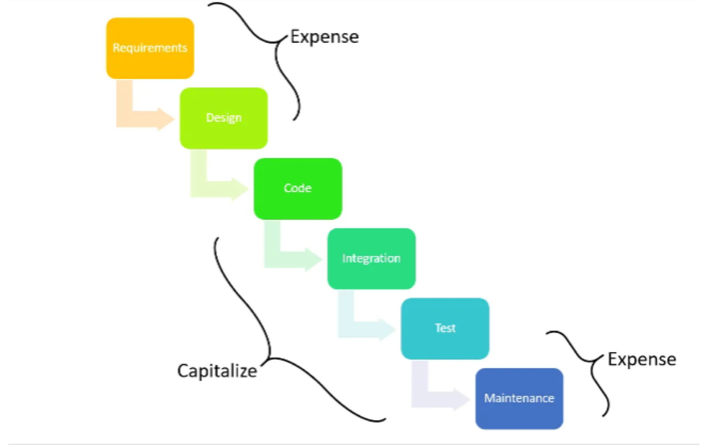

Ok. Product Capitalization as a process sucks.

But also, product capitalization has a weird and beautiful sense of completion and structure. When all the hours of each developer match throughout the whole year, across all projects, it's a sense of accomplishment like watching a really dirty car get cleaned with a pressure washer.

Jokes aside — that was my first capitalization process, and I think it's actually a valuable exercise for tracking the development of your product and making better decisions about how to allocate your resources.

Key takeaways from this process:

- Google Sheets — I remember our love-hate relationship with it from the marketing days.
- Finance people are Excel GODS, especially our CFO @instacar, K. Samartzis.
- `vlookup` is your friend.
- If you don't have a structured process for tracking your sprints (or cycles), you're going to have a hard time keeping track of your capitalization costs. Obviously I learned this the hard way.

Mistakes to avoid when making your first Product Capitalization report:

- R&D costs are not capitalized. A prototype is not an asset, it's just part of the research process.
- Only salaries of the development team, testing team, and some indirect and testing costs can be capitalized (technical architecture, for example).
- Product development is an ongoing process, and it's important to track capitalization costs separately from software maintenance costs once the product is live. Capitalization costs are incurred when you're developing new features or functionality; software maintenance costs are incurred when you're fixing bugs or making minor changes to existing features. A rule of thumb to easily keep track of the expenses:

> Capitalisation = Total development costs × (Hours for new feature development / Total hours billed).

