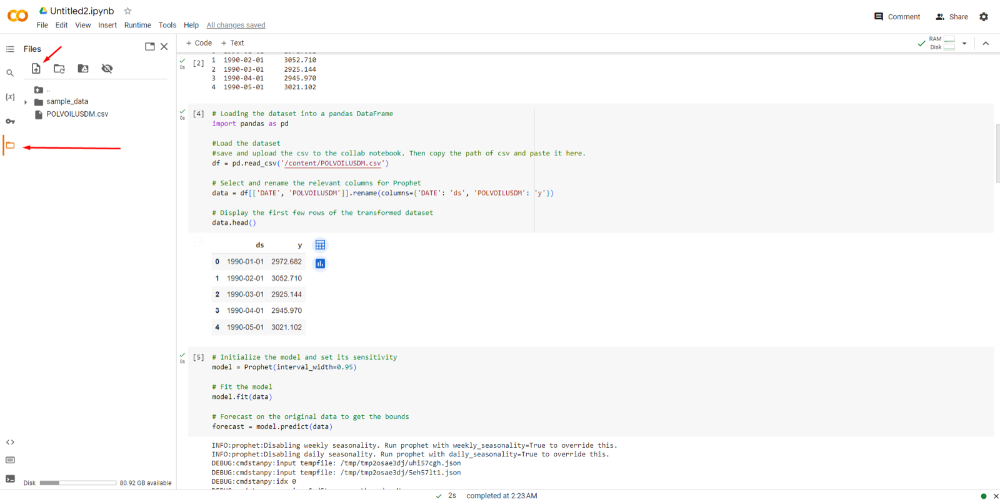
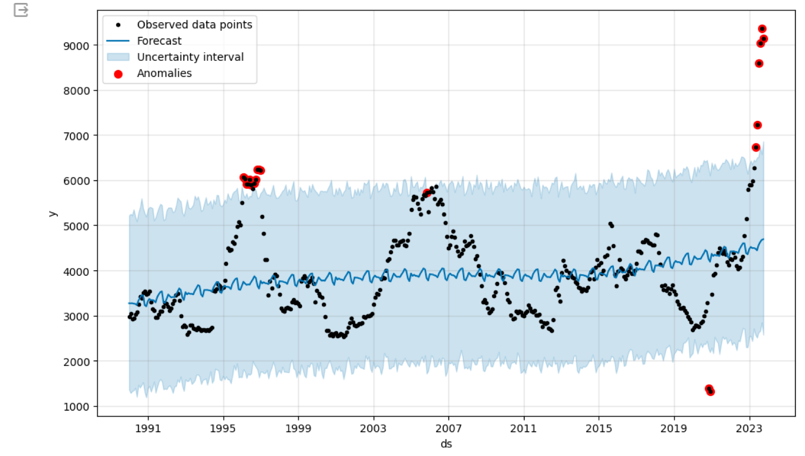
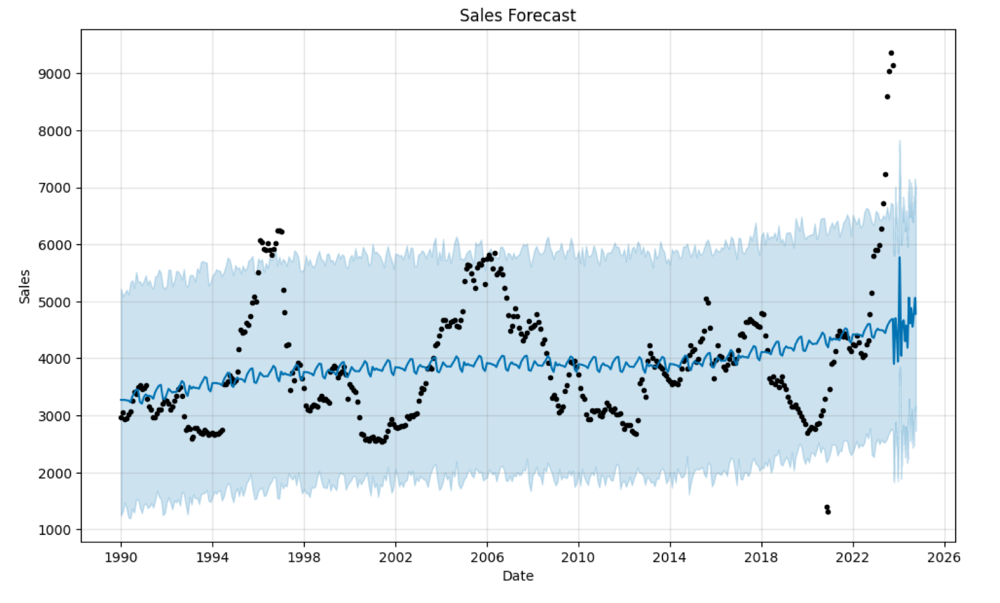
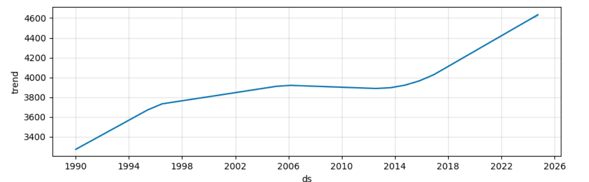
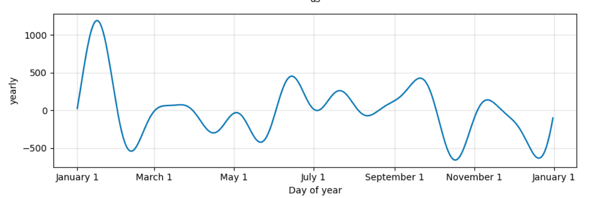

## Rationale

Intrigued by my friend Kostas's [blog post](https://kgiamalis.co/blog/code-anomaly-detection), and with the assistance of ChatGPT, I dived into the world of forecasting and anomaly detection at instacar. He crafted the necessary code to take advantage of the full potential of the Prophet tool — a step-by-step guide.

In my past experience in the marketing field, forecasting wasn't just a task — it was an essential compass that guided strategic decisions around major pillars in my previous company (app installs / uninstalls, budgeting marketing spend, etc.). Basically, forecasting is about understanding past and present data to make educated guesses about the (near) future.

With Prophet and the coding insights from ChatGPT, we can easily translate these principles into actionable insights.

## Why Prophet?

Prophet is famous for its ease of use, making it an attractive option for product managers who aren't experts in time series analysis or statistics. The tool simplifies the forecasting process with intuitive parameters and supports custom seasonality and holidays, which are critical in business forecasting tasks.

As Kostas suggests, we can use a [Colab notebook](https://colab.research.google.com/).

## Understand Your Data

Before using any tool, it's crucial to understand the data you're working with. For Prophet, your data should be in a two-column format:

- **ds**: the dates.
- **y**: the metric you wish to forecast (in our case, a dataset from Kaggle for car sales forecasting).

Your data might look something like this:

| ds | y |
| --- | --- |
| 2023-01-01 | 100 |
| 2023-01-02 | 105 |
| 2023-01-03 | 103 |

## Import the Required Packages

```python
# Download necessary libraries
!pip install pandas
!pip install matplotlib
!pip install prophet

# Load necessary libraries
from prophet import Prophet
```

## Load and Prepare Your Dataset

Load your dataset into a pandas DataFrame and make sure it is in the correct format for Prophet, which requires a 'ds' column for dates and a 'y' column for the values you want to predict.

```python
# Loading the dataset into a pandas DataFrame
import pandas as pd

# Save and upload the csv to the Colab notebook. Then copy the path of the csv and paste it here.
df = pd.read_csv('/content/POLVOILUSDM.csv')

# Select and rename the relevant columns for Prophet
data = df[['DATE', 'POLVOILUSDM']].rename(columns={'DATE': 'ds', 'POLVOILUSDM': 'y'})

# Display the first few rows of the transformed dataset
data.head()
```

You can upload the file into the Colab notebook, as shown below:



> Make sure you rename the `.csv` columns (case sensitive) to **ds** and **y**, otherwise Prophet cannot run.

## Create and Fit the Prophet Model

```python
# Initialize the model and set its sensitivity
model = Prophet(interval_width=0.95)

# Fit the model
model.fit(data)

# Forecast on the original data to get the bounds
forecast = model.predict(data)
```

- **Understanding interval width:** the interval width is set between 0 and 1, where a wider interval (closer to 1) reflects more uncertainty in the forecasts, and a narrower interval (closer to 0) reflects less uncertainty. The uncertainty interval encompasses the range within which future points are expected to fall, given a certain level of confidence.
- **Experimentation:** you can experiment with `interval_width` to see how it affects your forecast. A smaller value gives a narrower confidence interval, suggesting more certainty; a larger value suggests less.

> The commonly used `interval_width` is **0.8** or **0.95**.

## Calculate the Anomalies

Anomalies are the points where the actual observations did not fall within the expected range. If a data point is above the upper bound or below the lower bound, it is flagged as an anomaly.

```python
# Calculate the anomalies plus the upper and lower bounds
anomalies = data.loc[(data['y'] > forecast['yhat_upper']) | (data['y'] < forecast['yhat_lower'])]
```

## Visualize the Results

```python
# Visualize the results
import matplotlib.pyplot as plt

# Plot the Prophet forecast
fig1 = model.plot(forecast)

# Overlay the anomalies
plt.scatter(anomalies['ds'], anomalies['y'], color='red', s=50, label='Anomalies')
plt.legend()
plt.show()

# The red dots are dates that are considered anomalies.
```



- **Black dots:** the observed historical data points for olive oil prices.
- **Blue line:** the forecasted trend line, indicating the direction and behavior of olive oil prices according to the model.
- **Shaded blue area:** the uncertainty interval around the forecast, giving a range where future points are likely to fall, with a certain confidence level.
- **Red dots:** identified anomalies, points where the actual prices fell outside the model's predicted range — unusually high or low.

The chart suggests that, overall, the price of olive oil has been increasing over time, with some significant spikes the model did not predict, marked as anomalies. These could be due to unexpected market events or other external factors not captured by the model.

## Print the Data Points for Further Investigation

```python
# Print the data points that were flagged as anomalies
print(anomalies[['ds', 'y']])
```

## Now, Let's Proceed with the Actual Forecasting

We need to create a DataFrame that contains the dates for which we want to make predictions. Prophet provides a convenient method for this.

```python
# Specify the number of future periods to predict
future_periods = 365  # For example, forecasting for 1 year

# Generate future dates
future = model.make_future_dataframe(periods=future_periods)

# Display the last few rows to verify
future.tail()
```

This creates a DataFrame named `future` with dates extending into the future for the specified number of days (365 here, one year).

### Making Predictions

```python
# Use the model to make predictions
forecast = model.predict(future)

# Display the first few predictions
forecast[['ds', 'yhat', 'yhat_lower', 'yhat_upper']].head()
```

`yhat` is the predicted value, while `yhat_lower` and `yhat_upper` represent the lower and upper bounds of the prediction interval.

### Visualizing the Forecast

```python
# Plot the forecast
fig2 = model.plot(forecast)

plt.title('Sales Forecast')
plt.xlabel('Date')
plt.ylabel('Sales')
plt.show()
```



The sharp fluctuations towards the right-hand side of the graph, beyond the historical data range, are the model's predictions. If they seem unrealistic or too volatile, it may be due to the model being influenced by outliers or noise in the historical data, or the model's parameters needing tuning. If there isn't clear yearly seasonality, or the data doesn't cover multiple full seasonal cycles, predictions become less reliable.

You should also check the data for errors and review the model's assumptions and parameters. Consider business knowledge and domain expertise when evaluating the plausibility of any forecast.

### Plotting Forecast Components

Prophet lets you see components of the forecast such as trends and seasonalities.

```python
# Plot forecast components
fig3 = model.plot_components(forecast)
plt.show()
```



**Trend:** a long-term increase in olive oil prices over time, a general upward movement.



**Yearly seasonality:** a repeating pattern within each year, likely capturing seasonal effects on olive oil prices.

The model seems to capture an overall trend of increasing prices and a seasonal pattern that repeats annually. Note that as we move further from the last historical data point, the confidence interval widens, indicating increasing uncertainty in the forecast.
