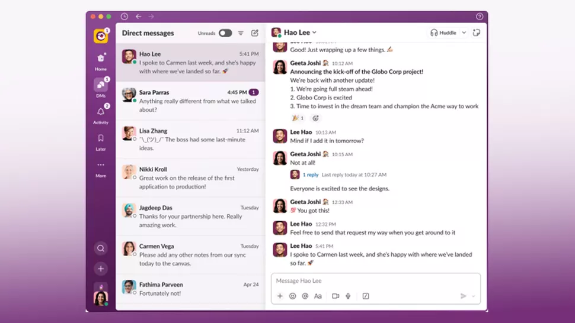

Slack recently rolled out a new UI/UX update aimed at "enhancing user experience and productivity" ([official release](https://slack.com/blog/productivity/a-redesigned-slack-built-for-focus)). While innovation is always welcome, it's equally important to understand how these changes are received by the actual user — and oh my, some of these changes feel weird, and honestly I didn't even know I needed them.

So let's break some of them down.

## Merged Workspaces

Merged workspaces feel a little "nesty". If you have a notification from another workspace (I'm a member of 5-6), you have to click into the nested workspaces and then find the right one to navigate to. I woke up with ~25 notifications and the UI displayed them on the instacar workspace — almost had a heart attack, thought something critical was happening.

You have to do more clicks and scan all workspaces for new messages and mentions, which is kind of absurd, even if the workspaces are displayed on hover. Also, you can't ungroup them if you want to.

## Colours

Colors changed to a gradient, which I don't like aesthetically. But it's not only the looks — it's the functionality too. In "light" mode, no matter how much you customize it, the left Slack bar can't change to white and everything seems blurry and hard to read: a contrast problem. Aubergine-black is my go-to for now, but honestly the old Slack colors seemed sharp and minimal.

The Slack update takes some serious hits at the moment — there's even a [petition](https://www.change.org/p/petition-for-slack-to-revert-back-to-its-original-design) to revert the changes. Check the /slack subreddit and you'll easily find more dysfunctional changes with this update.

It would be interesting to have actual data on Slack competitors (like Microsoft Teams) from the rollout day onward.
