We recently had the pleasure of sharing instacar's journey in product development at [Product Tank Athens](https://www.mindtheproduct.com/producttank/), co-presented with Alexandros Galanis. The theme of our talk was "The Art of Fast Delivery," where we dug into the mechanics and philosophy driving instacar's success.

## Pioneering Digital Transformation

instacar stands as the first fully digitized leasing company in Greece. Our 'instadriver App' and 'instacar Web' are testaments to our commitment to revolutionize the mobility landscape. Through our digital platforms, we've placed the power of choice and convenience directly into our customers' hands, reinforcing our 'Customer First' philosophy.

## Why Speed Matters

Our culture is characterized by a 'Culture of Velocity'. We've honed the art of rapid iteration and cross-functional collaboration to ensure that each stride we take is in sync with our market's pulse and our customers' evolving needs. This approach has been instrumental in our ability to implement a strategy that is adaptable, dynamic, and unyieldingly customer-centric.

### Culture of Empowerment

Empowerment is a core principle. By entrusting our teams with ownership and encouraging open communication, we've cultivated an environment where decision-making is swift and innovation thrives. We also embrace dissent, not as a hurdle, but as a critical element of our decision-making process, ensuring quality and comprehensive vetting of ideas.

### The Efficiency of Meetings

We've redefined meetings to be powerhouses of productivity, aligning them strictly with purpose and action. By doing so, we respect our most valuable asset — time.

### Strategy over OKRs

Our strategy goes beyond conventional Objectives and Key Results (OKRs). We prioritize our business needs with a two-month roadmap that's agile and responsive to real-world feedback, ensuring our objectives are aligned with our strategic growth and customer satisfaction.

### Keep Iterating, Stay Curious

Our success is built on a fundamental belief: 'Doing is better than planning.' This mantra has guided us to prioritize action and maintain a mindset of perpetual curiosity and continuous improvement.

## Special Thanks

Special thanks to [Alexandros Galanis](https://www.linkedin.com/in/alexandros-galanis-5a0538184/) for his deep-dive insights and [Kanella Dionysopoulou](https://www.linkedin.com/in/kanella-dionysopoulou-bb52211a3/) for the impactful visual design that brought our narrative to life.

Keep iterating and stay curious!

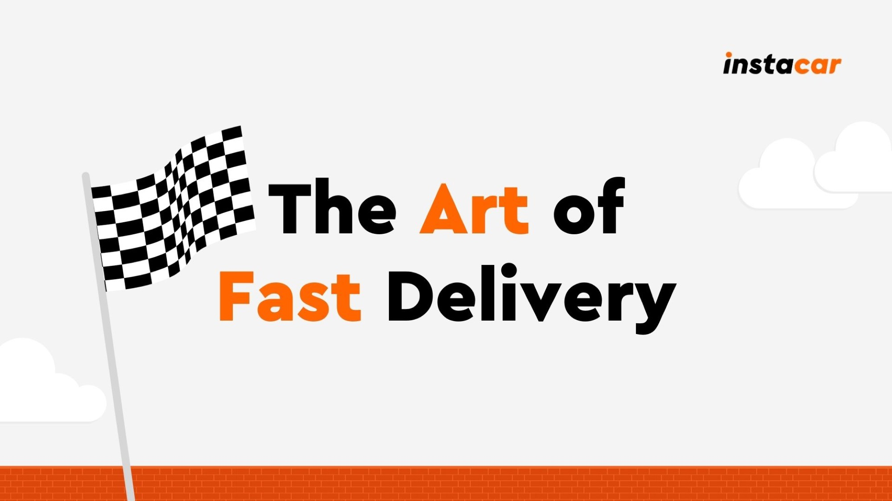
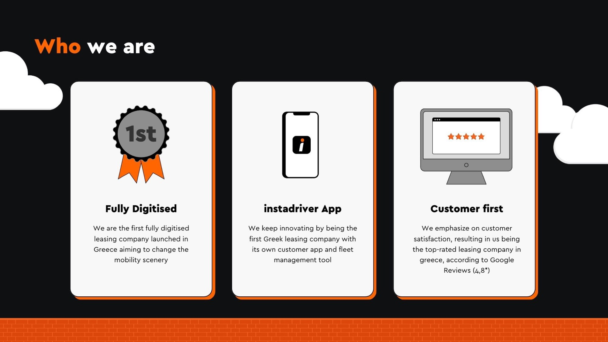
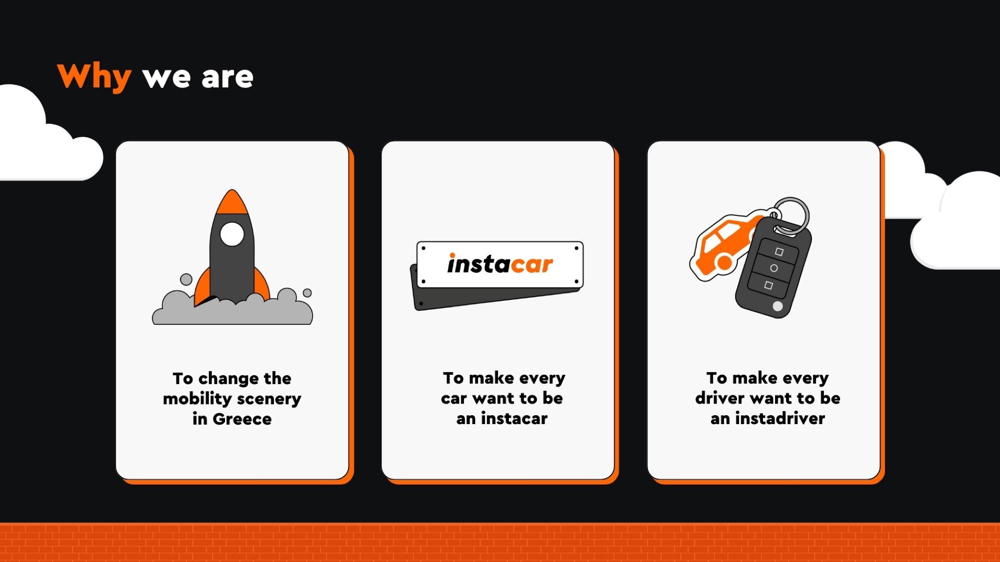
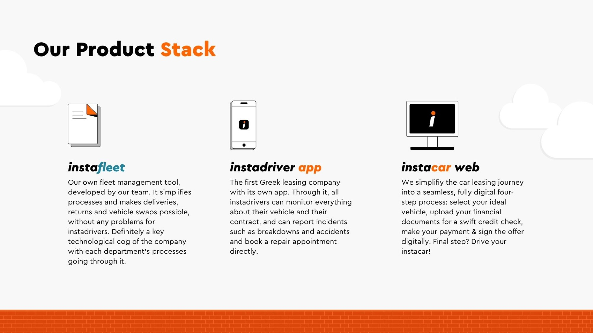
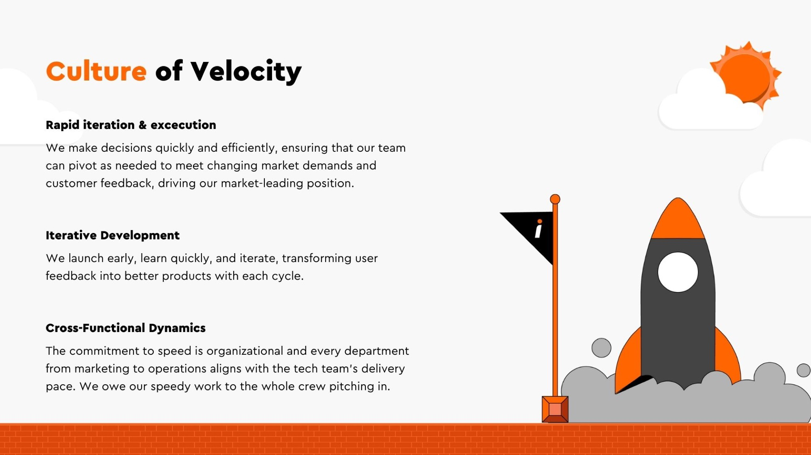
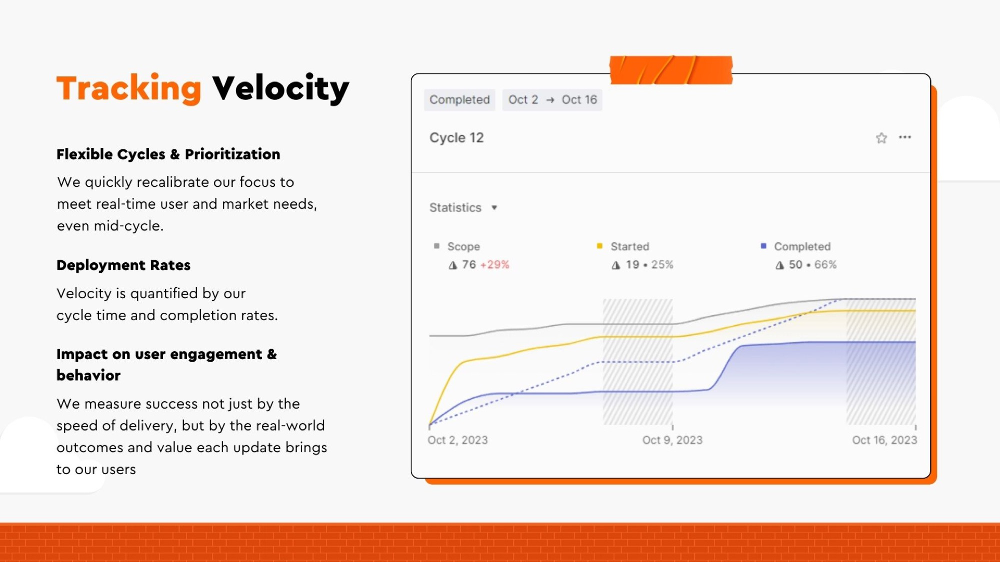
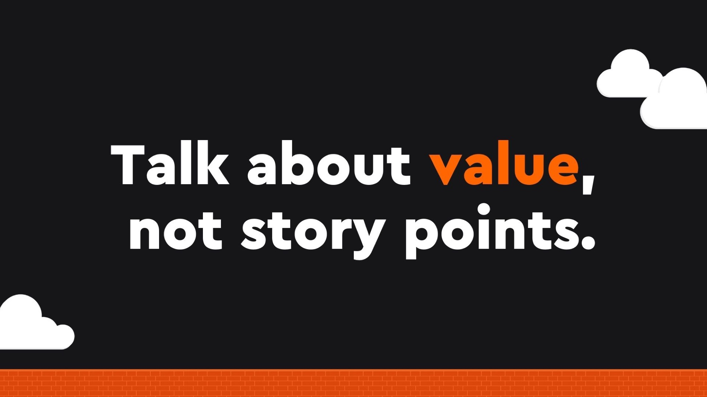
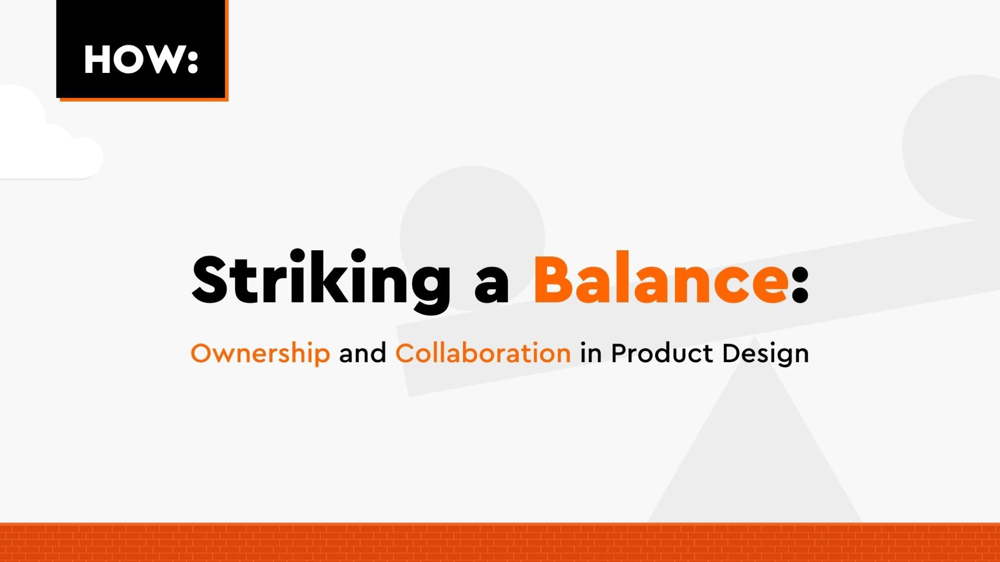
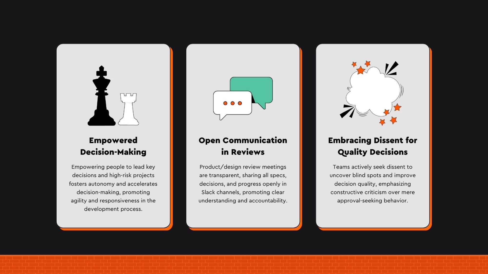
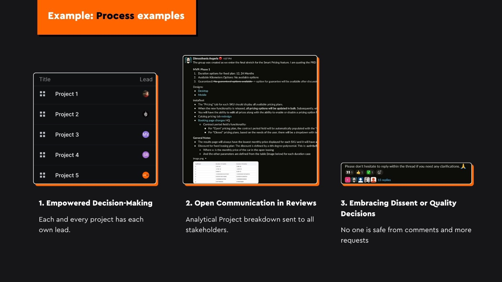
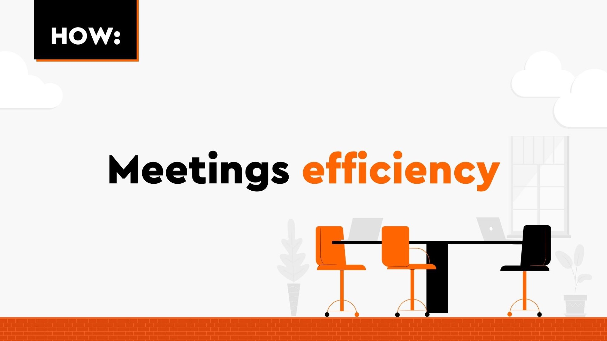
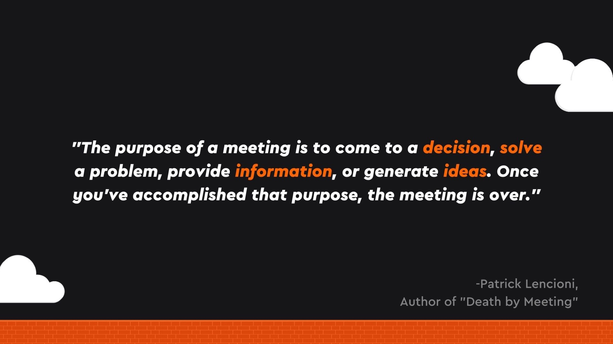
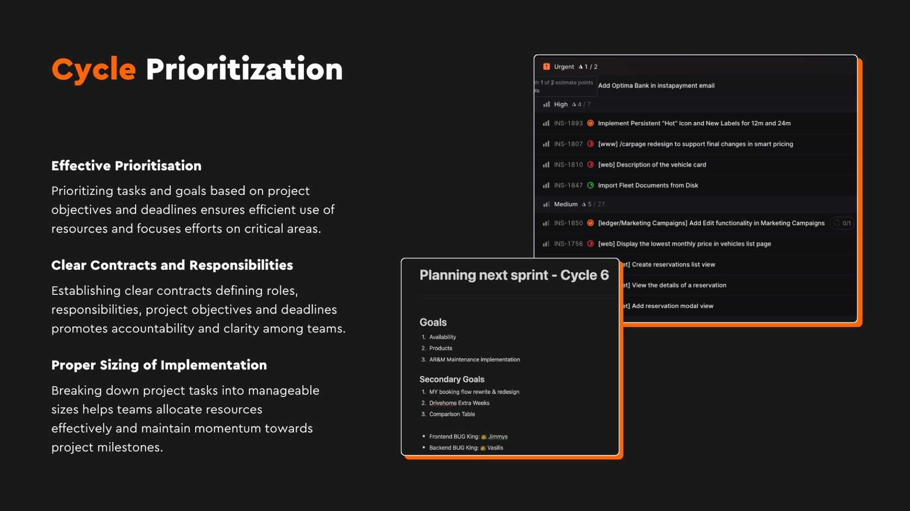
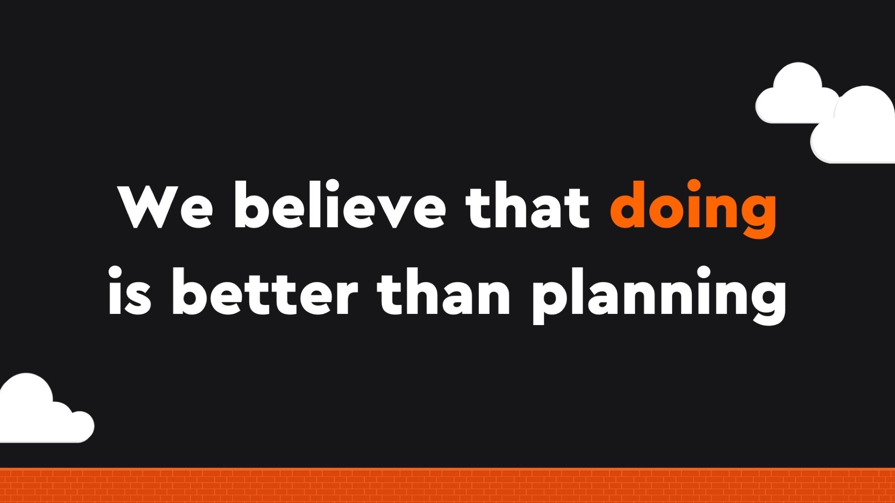
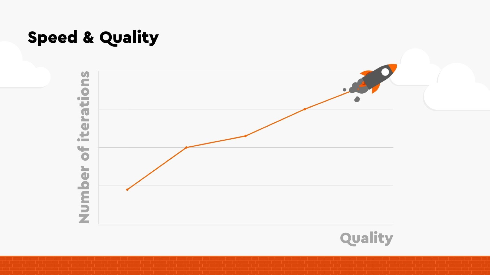
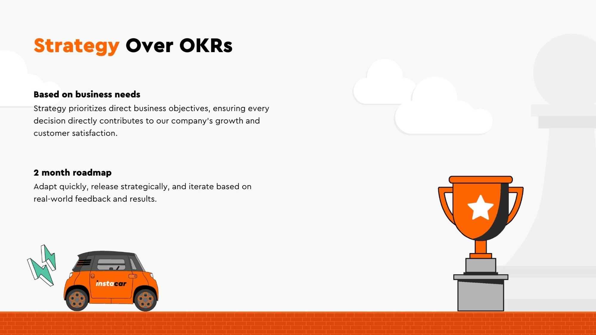
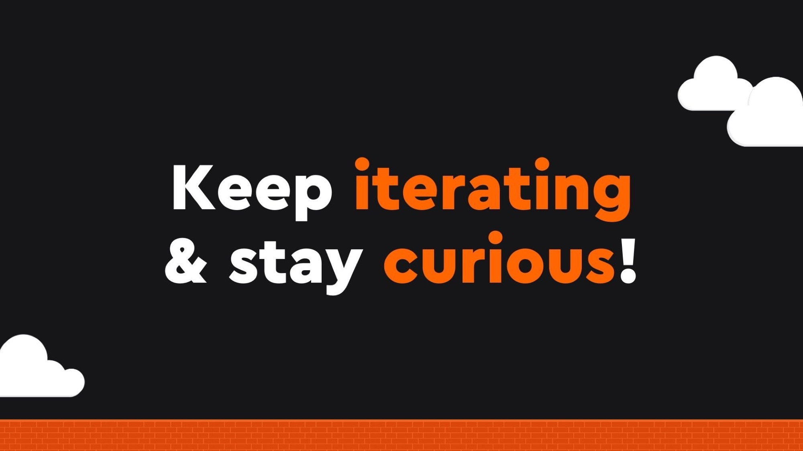
