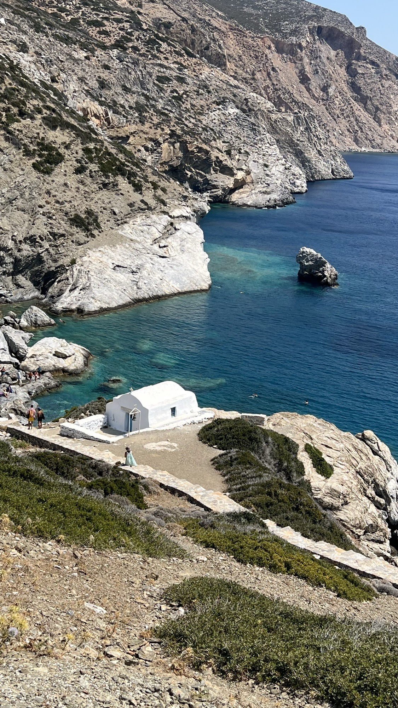

Today, I swapped my usual office view for a calming beach scene on [Amorgos](https://en.wikipedia.org/wiki/Amorgos) island. Usually my days are packed with meetings, decisions, and problem-solving. But today, the only decision I had to make was whether to swim in the clear water or relax in the sun.

This change isn't just a vacation, it's a reset. A reset is a mindful choice to step away from the daily hustle, to recharge, and to refresh. It's about giving your mind and body the rest they need, to ensure you can keep doing your best.

In her book *The Reset: Ideas to Change How We Work and Live*, Elizabeth Uviebinené talks about the importance of taking a break. She writes:

> The world doesn't stop when we do. In fact, it gives us the chance to observe and interact with it from a new perspective.

I realized that stepping away from my work didn't mean I was falling behind. Instead, it offered me a new perspective — a chance to observe my life and my work from a distance.

So, here's to the reset, to the chance to recharge, and to the opportunity to return to our work with a fresh perspective and renewed energy.

Here's the first photo on Amorgos, at a beach called Saint Anne.

