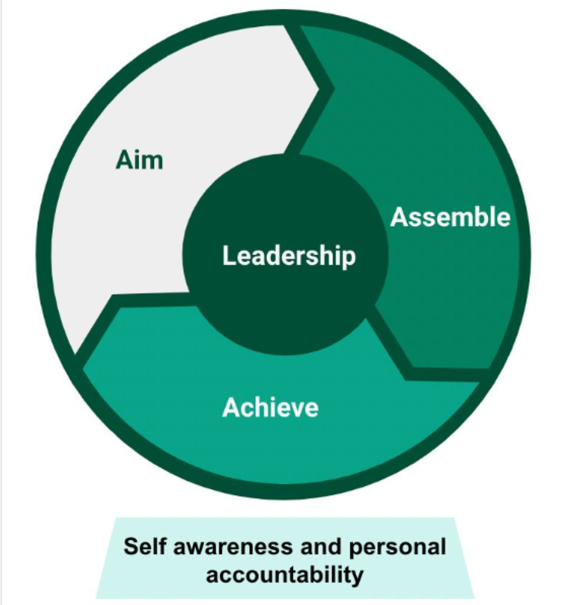

That's not a motivational speech. That's the AAA framework that Shopify's product team uses for clarifying responsibilities on projects.

The **aimer** is responsible for the strategy. It might not be the most senior person in the room — that's the whole point of the framework.

The **assemblers** are responsible for getting the puzzle pieces together: coordinating design aspects, spec gaps, project metrics, and the list goes on.

The **achievers** are those who actually do the work.

Glen Coates, VP Product, said:

> Most companies think of hierarchy and jobs basically as this sort of single line of leadership downward, based on how senior you are. But a few years ago we introduced the AAA framework. The idea is you don't want to take on a leadership job and suddenly be responsible for aiming when you're really passionate about assembly, or the other way around. It's helped us put people in the right roles and not just have one dimension of leadership that everyone has to conform to.
